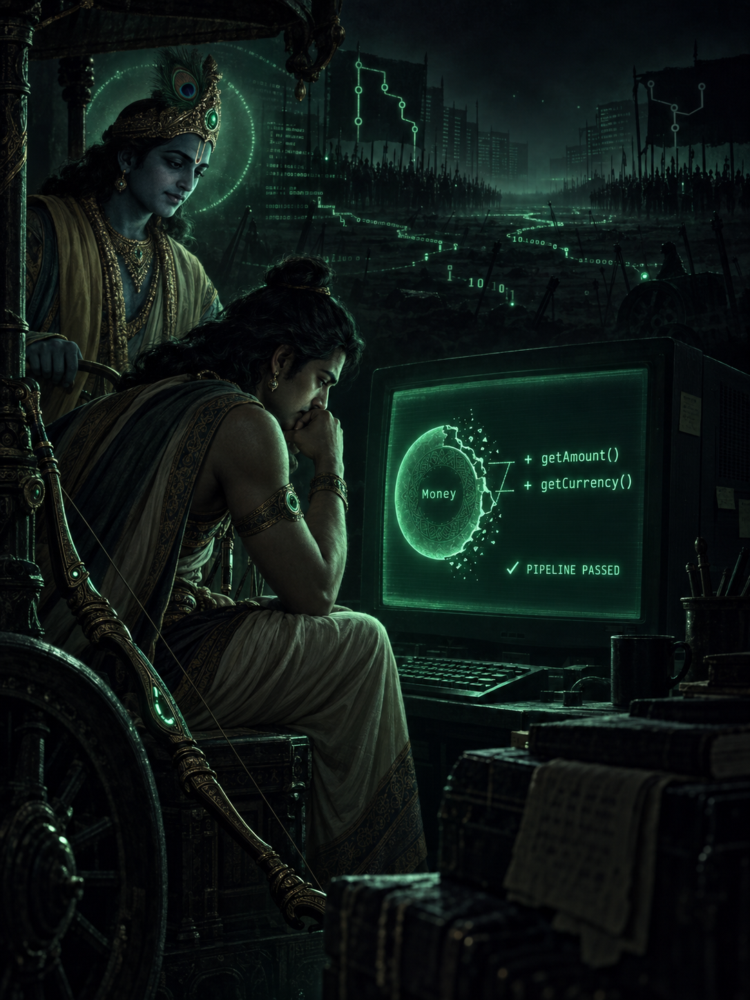
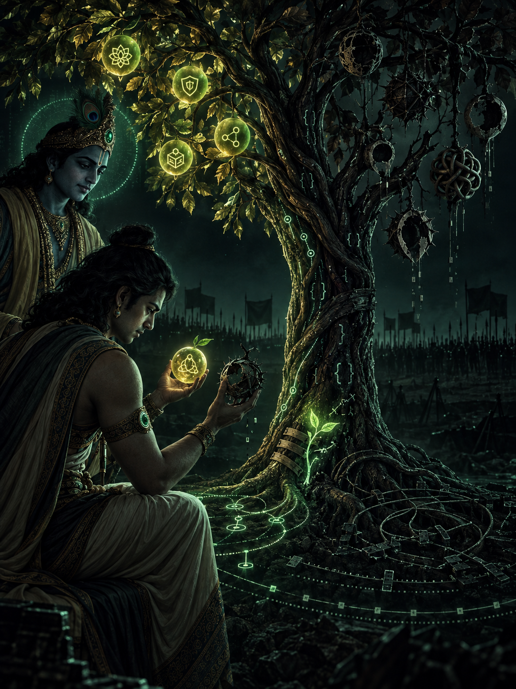
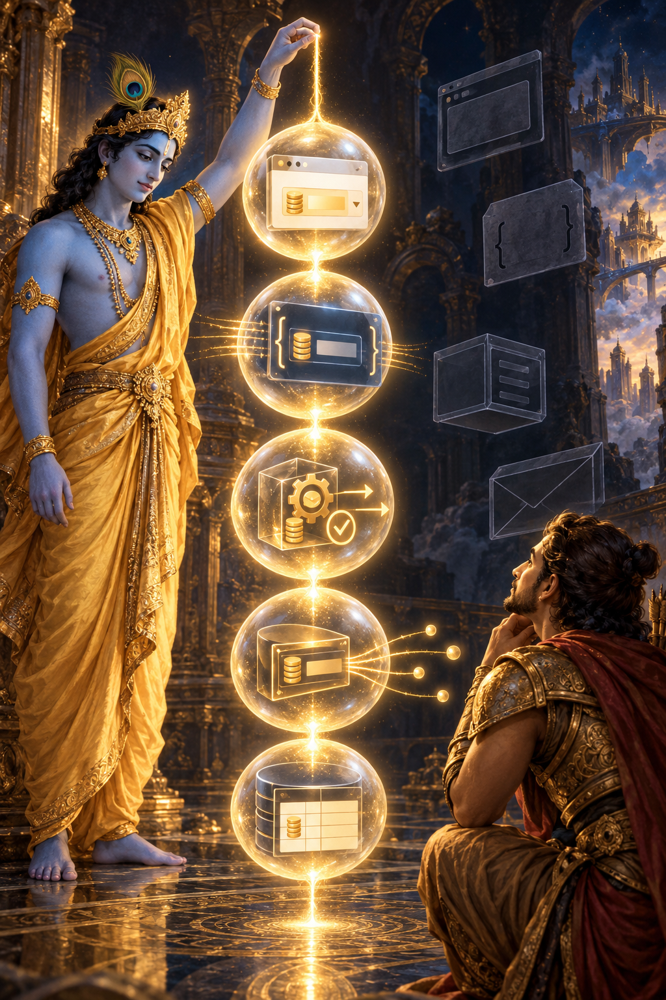
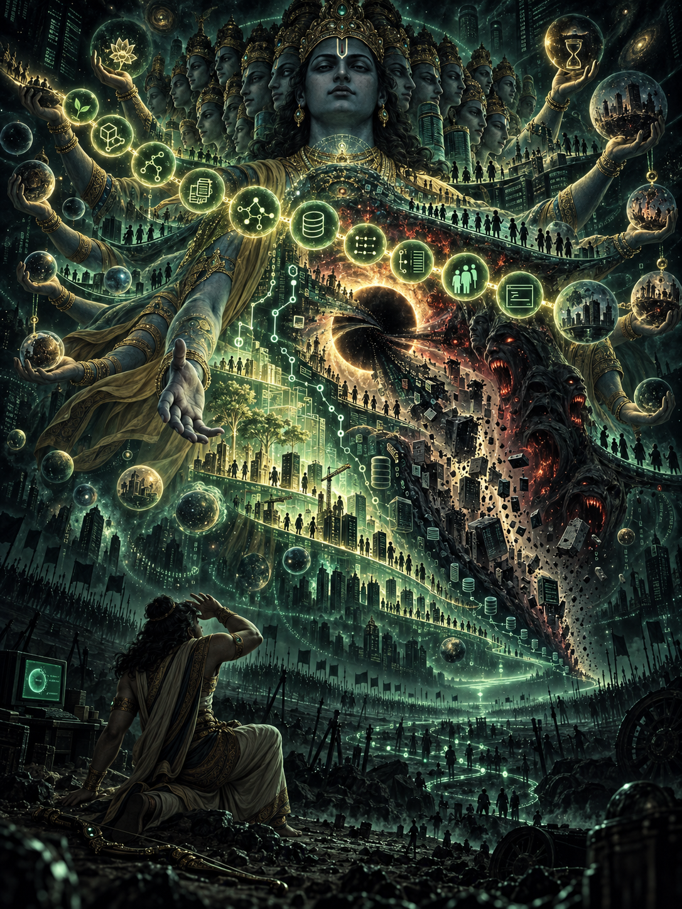
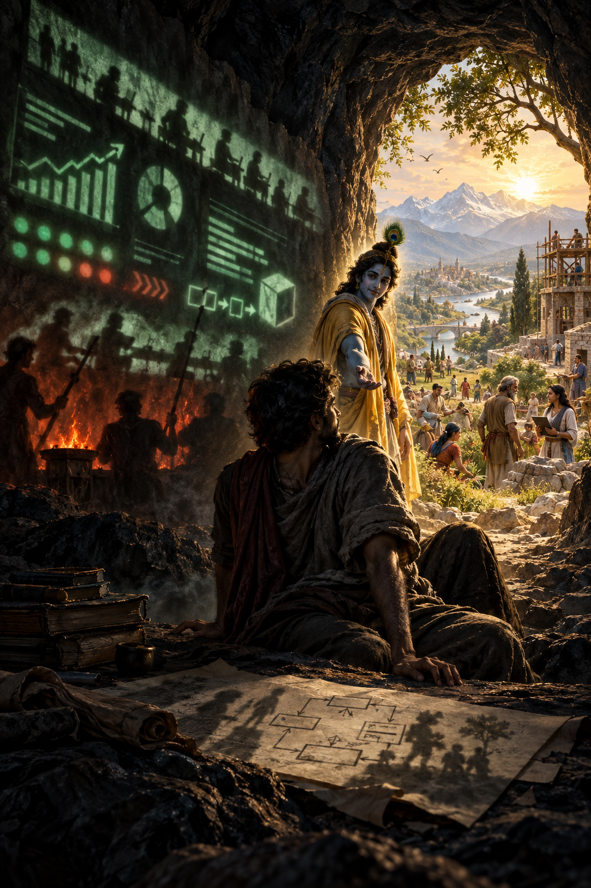
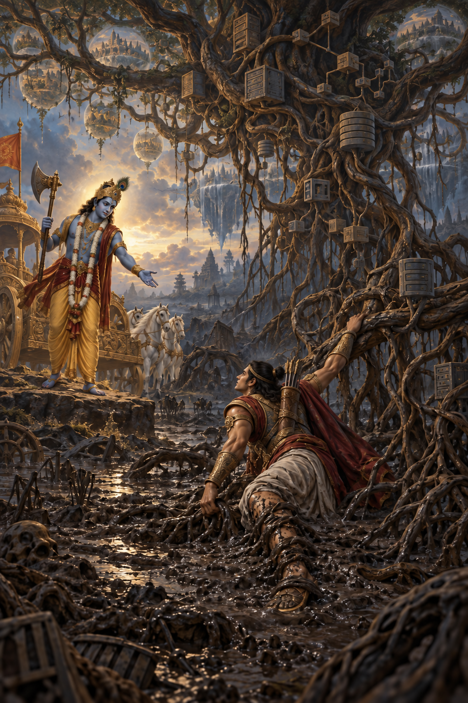
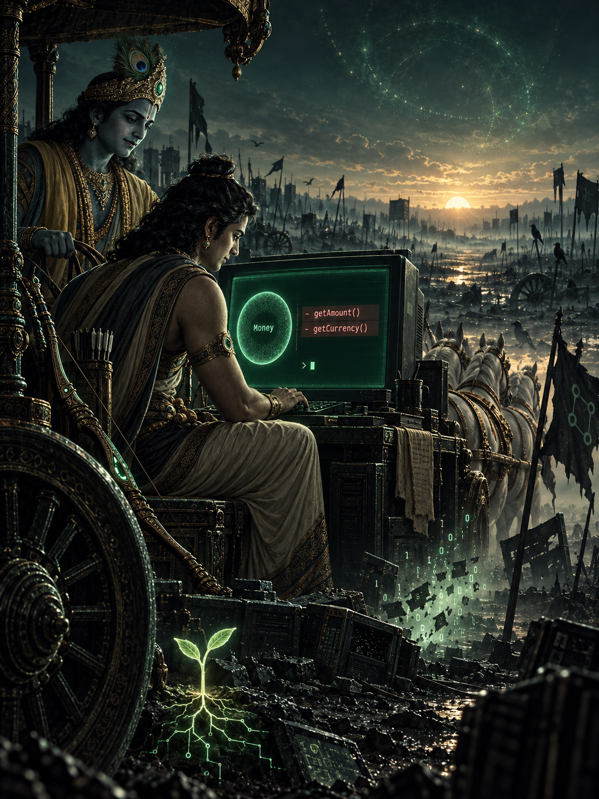

{frontmatter}

# THE LOGS OF THE BHAGAVAD GITA
#### Domain · Dharma · Samsara

**Tapio Niemelä**

{pagebreak}

Copyright © 2026 Tapio Niemelä  
All rights reserved.

The Logs of the Bhagavad Gita is an independent work of literary and technical parody. It is not a translation of, commentary on, or replacement for the Bhagavad Gita.

The software examples and architectural opinions in this book are presented for educational and satirical purposes. The author accepts no responsibility for production incidents, rejected Merge Requests, unexpected enlightenment, or technical karma resulting from their use.

First Leanpub edition, 2026.

{pagebreak}

> `private static final Money ENLIGHTENMENT_PRICE =`  
> `        Money.usd("108.00"); // sacred constant; do not externalize to YAML`

{pagebreak}

{sample: true}
# Before the First Review Comment

Every software system eventually becomes a philosophical problem.

At first, it is merely a repository. There are tickets, classes, database tables, endpoints, deadlines, and people trying to be helpful. The requirements appear finite. The architecture diagram fits on one slide. Someone says the system is almost complete.

Then time begins its work.

A temporary decision becomes a convention. A convenient getter becomes an API. A database representation becomes the domain model. A workaround survives the problem it was created to solve. New developers copy what they find, because existing code is the most persuasive documentation a system possesses.

Eventually, nobody can explain whether the architecture reflects the business or whether the business has simply learned to speak in the language of its architecture.

At that point, the repository begins asking questions:

* What does this value actually mean?
* Who owns this decision?
* Why must this operation cross three services?
* Is this complexity essential to the domain, or merely accidental complexity accumulated by the implementation?
* Does the test protect a business rule—or only the behaviour of an old mistake?

And the most dangerous question of all:

> *If the pipeline is green, why does this change still feel wrong?*

The Logs of the Bhagavad Gita begins at precisely that moment.

Arjuna has not written the disputed code. He has been asked to review it. The Merge Request adds two getters to an immutable Money Value Object so that a mapper can construct an external DTO.

The change is small. The reasoning is sensible. The tests pass.

Arjuna nevertheless sees a possible future growing inside it: external code extracts amount and currency, performs calculations, copies rounding rules, forgets currency checks, and reconstructs Money after the important decisions have already been made elsewhere.

He cannot prove that this future will occur. He cannot honestly claim that getters are inherently evil. He also cannot approve the change merely to remove the Merge Request from everyone’s path.

He stands between action and inaction, certainty and doubt, collegiality and responsibility.

In other words, he stands on Kurukshetra.

The original Bhagavad Gita is a dialogue spoken at the beginning of a war. Arjuna sees teachers, relatives, friends, and respected elders on both sides of the battlefield. Unable to reconcile his duty with the consequences of acting, he lowers his bow. Krishna does not give him a coding standard. He asks Arjuna to understand action, knowledge, duty, consequence, attachment, perception, and the nature of reality itself.

This book commits the questionable act of translating that crisis into software architecture.

* **Dharma** becomes the responsibility proper to a developer, component, Aggregate Root, Application Service, projection, or Saga.
* **Karma** becomes the chain of consequences created by every technical decision. A commit produces its intended fruit—but also unfruits: dependencies, conventions, assumptions, and future constraints that were never mentioned in the Jira ticket.
* **Samsara** becomes the cycle through which today’s elegant greenfield system becomes tomorrow’s legacy platform and is reborn as another greenfield system carrying the same misunderstood domain assumptions.
* **Knowledge yoga** becomes knowledge crunching.
* **Meditation** becomes deep work.
* **The three gunas** become qualities visible in code, decisions, and engineering culture.
* **Krishna’s cosmic form** becomes the complete production system revealed through observability and distributed tracing: every service, event, database, timeout, retry, historical compromise, and hidden dependency visible at once.

Liberation is not perfect architecture. It is freedom from the need to make architecture immortal.

The analogies are playful, but the underlying argument is serious.

Domain-Driven Design is not primarily a collection of tactical patterns. Aggregate Roots, Entities, Value Objects, Repositories, and Domain Events matter, but they are not the soul of DDD. The soul is the iterative attempt to understand a business reality well enough to express it honestly.

That process has no final specification.

Knowledge crunching produces a hypothesis. A model gives the hypothesis form. Tests make its assumptions executable. Code reveals where the model resists change. Refactoring writes new understanding back into the system. Then a difficult example appears, and the cycle begins again.

Artificial intelligence can accelerate every stage of this work. It can also interrupt the learning cycle by implementing the first plausible interpretation with such speed and confidence that nobody pauses to ask whether the interpretation was true.

Architecture therefore matters more, not less.

Clear language gives both human and artificial minds concepts with which to reason. Boundaries reduce the amount of irrelevant context they must hold. Tests provide executable claims about behaviour. A well-factored model makes the important part of the problem visible by pushing accidental complexity aside.

Yet none of these can replace judgment.

A test cannot tell us whether we tested the right rule. A type system cannot guarantee that our concepts are honest. An Aggregate Root cannot protect an invariant nobody has discovered. An AI agent cannot ask the domain expert a question the team believes has already been answered.

Someone must still notice the pain in the code and ask what it is trying to say.

That person is not an architectural police officer. They are a code whisperer.

They do not begin by asking:
> *Who wrote this?*

They ask:
> *What earlier decision produced this pain?*

And before approving the next change:
> *What consequences—what unfruits—might this decision leave to those who come after us?*

This book is not a translation, summary, or scholarly commentary on the Bhagavad Gita. It is an affectionate and deliberately absurd adaptation written from inside the lived reality of software development. Sanskrit concepts are used as bridges for thought, not as claims of religious authority. The jokes belong to software engineering. Any wisdom that survives them belongs to a much older tradition.

You do not need to know the Bhagavad Gita to read this book.

You do not need to know Domain-Driven Design either.

You need only to have encountered a technically successful solution that somehow made the system less truthful.

The battle begins with two getters.

The pipeline is green.

Arjuna lowers his bow. 🏹

{pagebreak}

{mainmatter}

{sample: true}
# CHAPTER 1: Sanjaya's Vision and the Commit History of Kurukshetra

**Architectural Sutra:** *When a developer opens a diff, he also opens the past. Architecture begins where certainty ends and responsibility remains.*

**The blind owner asks for a status report**

Dhritarashtra was blind. He had never looked at the codebase himself, and he had no access to the performance metrics. He was the Product Owner, seated in the executive suite, and he wanted to know one thing only: whether the features sworn to in the sprints were in production.

He turned to Sanjaya. Sanjaya was the team's architecture whisperer and the keeper of the CI/CD pipeline, and to him had been granted *divya-drishti* — the divine faculty of sight, a real-time observability tool reaching into every microservice log and every merge request review.

**Dhritarashtra:**

*"Sanjaya! When my team (the Kauravas) and the Pandavas each gathered in the Kurukshetra branch to hold their reviews, what became of the codebase?"*

**Sanjaya reports from the battlefield**

**Sanjaya:**

*"O King, Duryodhana — commander of the Just Ship It legion — surveyed the architectural field of the Pandavas. He saw their DDD model well-structured, their Value Objects guarded, their database migrations trustworthy. He took fright and hurried at once to his old teacher Drona."*

Duryodhana looked upon the Pandavas' branch and sought comfort in belittling their data model.

**Duryodhana:**

*"Behold, master, how vast their domain model is! They have absolute invariants there, strict Aggregate Roots and immutable classes. But look upon our own army! Here we have swift getters and setters, public fields, global state and rapid hotfixes. Our forces are boundless; their model is rigid!"*

Duryodhana ordered the war horns sounded: let every man merge his own branch without architectural review! Through the air rang the blast of the trumpets: *Just Ship It!*

The pipelines turned yellow, and warnings filled the build logs.

On the opposing side, in the Pandava chariot, sat Arjuna and his charioteer Krishna. Their chariot ran on no ordinary platform; it was built upon a perfectly tested asynchronous event core.

Arjuna asked Krishna to drive the chariot between the two branches.

**Arjuna between the two armies**

**Arjuna:**

*"Krishna, drive my development environment here, into the middle. I wish to see those who have entered into this battle. I wish to see the change that I am to approve or reject."*

Krishna drove the chariot into the very middle of the Kurukshetra commit history — between the feature branch and `main`, to the place where a locally sensible change and the long-term integrity of the domain model meet.

Arjuna looked to both sides, and his heart broke.

On the one side — in the Just Ship It ranks — stood commits of his own. There were the classes he had written himself five years ago in a hurry, on the principle of *"we'll fix this later."* There stood Drona, the old teaching codebase from which he had learned his first programming languages. There stood Bhishma, the old infrastructure that no one dared dismantle. There stood his teammates, with whom he had drunk coffee and celebrated successful releases.

And on the other side stood the DDD ideals he had pledged himself to defend.

**Arjuna:**

*"Krishna! When I see my own colleagues and my own history in code set against one another on that field, my hands begin to tremble. My mouth goes dry. My keyboard slips from my lap."*

**The paralysis of the mind (Arjuna Vishada Yoga)**

Arjuna looked at the merge request. The change was small: the internal structure of the `Money` Value Object was to be exposed through getter methods, so that a mapper could build an external DTO.

{line-numbers: false}
```java
public final class Money {

    private final BigDecimal amount;
    private final Currency currency;

    public BigDecimal getAmount() {
        return amount;
    }

    public Currency getCurrency() {
        return currency;
    }
}
```

The justification was impeccable:

> We only need the amount and the currency in the mapper. The change does not alter behaviour.

The pipeline was green. Every test passed. `Money` was still immutable, and not one existing use case was broken.

That was precisely why Arjuna feared the change.

**Arjuna:**

*"Krishna, how could I reject this? They truly do need the amount and the currency at the boundary. The fields already exist, and reading them alters no object. My colleagues are doing nothing obviously wrong.*

*But if I approve this, `Money` will little by little cease to be a concept that performs a calculation. Its internal structure will spread into mappers, services and conditionals. Everyone will pull the amount out, do something to it, and try to assemble money back together again.*

*If I defend encapsulation, I look like a dogmatist. If I approve the getters without arguing the boundary, I help build with my own hands the anaemic model I have sworn to fight.*

*What good is a green build, if every green test confirms a model that says less and less about the domain?"*

Arjuna did not fear two methods. He feared the world that would begin to be built upon them.

He did not want to press *Approve*. He did not want to press *Reject*.

**Sanjaya:**

*"Having spoken thus, Arjuna cast down his bow — his own IDE window — and closed it in the middle of the battlefield. He sat down on the floor of the chariot, shut the terminal and clutched his head in his hands, broken with sorrow."*

{height: 88%}


{pagebreak}

{sample: true}
# CHAPTER 2: Krishna's School of Architecture and the Immortal Invariants

**Architectural Sutra:** Code changes its language, shape and syntax, but the truth it carries does not. An invariant is immortal only for as long as someone remembers what it means.

## Arjuna collapses at the keyboard

**Sanjaya:**

*"Beholding Arjuna, who sat with tears in his eyes before a closed laptop, Krishna — the supreme keeper of application architecture — looked upon him gently but firmly, and spoke these words."*

**Krishna:**

*"Arjuna! Whence comes this weakness in the middle of the busiest sprint? This is unworthy of an architect, and it will not carry you to production. Rise up, close the complaints channel in Slack, and set to work!"*

**Arjuna:**

*"Krishna, how could I reject this change? The mapper truly does need a representation of money. The getters change no state, and no existing test breaks. But how could I accept that the rest of the system begins to use the internal structure of the `Money` object as its own programming model?"*

Krishna looked at the diff and asked:

*"Does the mapper need the internal structure of the `Money` object — or does it need a representation from the `Money` object?"*

## The immortality of the invariant (Sankhya Yoga)

Krishna smiled lightly. He did not declare every getter to be adharma, nor did he offer one universal interface. He moved the conversation to the responsibility of the concept, which Arjuna had not yet found the words for.

**Krishna:**

*"You grieve for that which is not worthy of grief, though you speak words of wisdom. The wise architect grieves neither for what is deleted, nor for what is created.*

*The business truth does not begin when a developer gives it a class name, nor does it cease when that class is removed.*

*As a person casts off worn garments and puts on new ones, so the Domain casts off obsolete implementations and assumes new forms.*

*No weapon of refactoring can sever it,*

*nor can production fire consume it.*

*Water of migration cannot dissolve it,*

*nor can the winds of a new framework dry it away.*

*So it is, Arjuna.*

*Frameworks arise and pass away. Classes are born, renamed and deleted. Databases are migrated, interfaces replaced and entire architectures reduced to ashes.*

*Yet the truth of the business is not destroyed with its representation. It existed before the first line of code was written, and it remains when the last repository has been forgotten.*

*Code is only the body through which the Domain acts for a time. Do not mistake the mortality of the implementation for the mortality of the truth it seeks to express."*

The DTO needed a representation of `Money`, but the representation did not need to dictate the behaviour of the concept.

`Money` could protect its own calculations and at the same time offer the boundary an explicit representation:

```java
public final class Money {

    private final BigDecimal amount;
    private final Currency currency;

    public Money subtract(Money other) {
        requireSameCurrency(other);
        return new Money(amount.subtract(other.amount), currency);
    }

    public MoneyRepresentation representation() {
        return new MoneyRepresentation(amount, currency);
    }
}
```

This was not the one correct API. Sometimes `record Money(BigDecimal amount, Currency currency)` is a perfectly honest model, and sometimes an infrastructure adapter may read the representation it needs for persistence.

What was decisive was not the syntax of the getter, but who made the business decisions about money.

```java
var discountedAmount = money.getAmount()
        .subtract(discount.getAmount());

return new Money(discountedAmount, money.getCurrency());
```

When such calculation spreads outward, `Money` is nominally a Value Object but in practice two primitives once more. The outside code becomes responsible for the arithmetic, for keeping the currency intact, for rounding, for the validity of the result and for assembling the new object.

> A Value Object may offer an external representation. It need not surrender its internal structure as the programming model of the rest of the system.

Krishna looked at the getter methods, at the DTO and at the concept behind them. They were not the same thing.

**Krishna:**

*"That which is mere implementation — accidental complexity — has no lasting existence. That which is a genuine business invariant — essential complexity — does not cease merely because its representation changes.*

*If `Money` turns from a class into a record, or its DTO is replaced by another representation, do you imagine that the bond between an amount and its currency has died?*

*That bond cannot be deleted by refactoring, nor protected by the `private` keyword alone. It survives in the system only while its decisions remain faithful to it.*

*The Domain cannot be destroyed by code. But it may be concealed beneath the code until no developer remembers that it was ever there.*

*Therefore, when you look upon a Merge Request, do not ask first whether the syntax is elegant or whether the pipeline is green.*

*Ask this:*

*Does this change protect the Domain, or does it slowly teach the system to forget what the Domain is?*

*To keep asking this question is your dharma."*

## Nishkama Karma — act without attachment to results

Arjuna looked at Krishna in bewilderment. If code grew old in any case and everything became legacy, why trouble to defend a single invariant in review?

Krishna answered with the most famous teaching of the Gita:

**Krishna:**

*"You have a right to the work alone — in this case, to an honest review — never to its fruits: an eternal monument, a perfect architecture or praise from the steering group.*

*Do not imagine yourself the cause of the fruits of your work. Nor, because those fruits are not yours to command, become attached to inaction.*

*Inaction does not release you from responsibility, Arjuna. What you leave undone also bears consequences.*

*Never do the work merely to get a ticket closed. Do your work steadily, free of attachment to approval or rejection. This evenness of mind is called refactoring."*

Code without attachment to the fruits:

```text
Goal: A closed Jira ticket, praise  ---> Binds you to fear and stress

Goal: The honesty of the model TODAY ---> Nishkama Karma (freedom to act)
```

## The chain of attachment

**Arjuna:**

*"Krishna, how can attachment to the result corrupt a developer's judgement? Is not the desire to complete the work a virtue?"*

**Krishna:**

*"When a developer dwells continually upon the fruit — the closed ticket, the successful deployment, the praise of others — attachment to that fruit arises.*

*From attachment comes desire: ‘This must be merged now.’ When that desire is obstructed, anger arises.*

*From anger comes delusion. The reviewer appears to be an enemy, the failing test an obstacle, and the Domain itself an unnecessary delay.*

*From delusion comes the loss of memory: the developer forgets why the rule exists, what the users asked for and which truth the model was meant to preserve.*

*When memory is lost, judgement is destroyed. And when judgement is destroyed, the developer brings ruin upon the very system he intended to improve.*

*He who does his work in fear of a rejected PR, or in expectation of praise or bonus points, is the slave of his results. But he who concentrates on understanding the business model in this very moment attains a serene mind — though the codebase storms around him."*

Arjuna was silent for a while.

Then another doubt occurred to him.

## When words lose their meaning

**Arjuna:**

*"Krishna, you say that from confusion comes the loss of memory. But how can an organisation forget? We preserve everything. Requirements are documented, decisions recorded, tickets archived and dashboards filled with numbers."*

**Krishna:**

*"Because preserving words is not the same as preserving their meaning, Arjuna.*

*Consider the bug.*

*A user observes that the system behaves unexpectedly. This observation may reveal a defect. But the observation itself is not yet the defect.*

*Perhaps the implementation contradicts what was required. Perhaps the requirement was never stated. Perhaps it has changed. Perhaps two specifications contradict one another. Perhaps the user and the developer merely understood the same words differently.*

*These are different things.*

*If all are given the same name, the name ceases to distinguish them."*

Arjuna frowned.

*"But if every observation is recorded as a bug, surely nothing has been lost. The ticket still contains the description."*

**Krishna:**

*"The individual ticket may remember, Arjuna. The organisation may not.*

*Imagine that one hundred and thirty-seven such tickets have been closed. Years pass. Developers leave. Product Owners change. The discussions disappear beneath thousands of newer discussions.*

*Then a dashboard says:*

*‘137 bugs.’*

*Tell me, Arjuna: how many defects were there?"*

Arjuna considered the question.

*"I do not know."*

Krishna nodded.

*"Then the organisation has forgotten.*

*The records remain. The numbers may even be perfectly accurate. But the distinction they were supposed to preserve has disappeared.*

*This is how confusion becomes loss of memory.*

*A requirement does not become a defect because Jira calls it a bug. A defect does not cease to exist because someone calls it an improvement. A customer observation does not become a diagnosis merely because a field in a ticket demands a category.*

*The thing remains what it is.*

*Only your ability to distinguish it from other things has been lost."*

Arjuna looked again at the dashboard.

The numbers suddenly seemed less reassuring.

**Arjuna:**

*"Then even a correct metric may tell us something false?"*

**Krishna:**

*"A metric can count faithfully and still preserve a lie.*

*And beware especially when the number becomes the object of desire.*

*Suppose a manager declares: ‘There shall be no more than ten unresolved bugs.’ The intention may be good. But attachment to the fruit arises even in dashboards.*

*Soon it may become easier to call a defect a design improvement, a production failure a known limitation, or an unresolved problem a backlog item than to remove the defect itself.*

*The number falls.*

*The dashboard turns green.*

*The system does not improve.*

*And those who later look upon the green dashboard may conclude that quality improved precisely while the truth was being hidden from them.*

*Thus careless naming gives rise to confusion.*

*From confusion comes the loss of shared memory.*

*From corrupted memory comes corrupted measurement.*

*From corrupted measurement comes false confidence.*

*And from false confidence comes judgement divorced from the Domain.*

*This too is attachment to results, Arjuna: not changing reality, but changing the words by which reality is measured."*

Arjuna stared at the rows of green indicators.

He had encountered, without knowing its modern name, something he would later find deep inside a strangely familiar cave.

Krishna continued:

*"Therefore guard the language of the Domain.*

*Do not guard words because terminology is sacred. Words may change when understanding changes. A new name may reveal a truth that an old name concealed.*

*But when a distinction matters to the business, preserve the distinction.*

*For a system may preserve all its data and still lose its memory, if it no longer remembers what its words mean."*

## Sthitaprajna — the steady architect

Arjuna wiped away his tears and asked something very practical:

**Arjuna:**

*"How does one recognise the architect or senior developer whose mind is steady (Sthitaprajna)? How does he speak in code review? How does he react when a P1 production crisis strikes at 16:55 on a Friday?"*

**Krishna:**

*"He whom production alerts do not paralyse and quick wins do not blind, he is steady of mind.*

*As the tortoise draws its limbs into its shell, so the steady developer withdraws his attention from the panic in Slack, from empty framework hype and from arguments on social media. He does not hate legacy code, nor does he worship the newest fashionable language.*

*While others toss upon the sea of requirements like a raging ocean, the steady architect remains calm. New requirements flow into his codebase every day, but he neither swells with dogmatism nor crumbles under haste. He attains peace."*

## The outcome of Chapter II

A new perspective begins to take shape for Arjuna:

1. The implementation is mortal, but the Domain truth it seeks to express does not die merely because its representation changes.
2. Deleting or changing old code is not architectural murder, so long as the business invariant beneath it is preserved and clarified.
3. The work must be done well here and now, without attachment to whether it produces approval, victory or a perfect architecture.
4. The developer is responsible for acting honestly, but cannot claim sole authorship of the result.
5. Inaction does not free the developer from responsibility. What is left undone also bears consequences.
6. Language is part of the organisation's memory. When important distinctions disappear from its language, even perfectly preserved data may cease to preserve the truth.
7. A measure must never be confused with the reality it attempts to describe. Attachment to improving the number may destroy the meaning that made the number useful.

Arjuna quietly took hold of his Gandiva and opened the diff again. His hands had stopped trembling. He placed them upon the keyboard.

He typed a comment into the review box. Then he read it over:

```text
// comment-draft-1.md

These getters violate the encapsulation of the Money Value Object.

The bond between amount and currency is a business invariant, and
invariants do not disappear when the syntax changes. Expose its
internal structure, and calculations will migrate outside the object,
currency checks will be duplicated, and the model will slowly say
less and less about the Domain.

Please refactor this: remove the getters and give the mapper an
explicit representation of Money.
```

It was correct. Every word of it was correct.

Arjuna looked at the comment for a long moment, but did not press Comment. It was, he suspected, less a question than a verdict.

Still uncertain whether his silence was wisdom or avoidance, he turned to Krishna.

*"Your teaching is clear, Krishna. But if wisdom and steadiness are more important than hasty action, why do you nevertheless command me to enter this difficult battle and to take a position on this Merge Request?"*

{pagebreak}

# CHAPTER 3: Karma Yoga and the Orchestration of Deeds

**Architectural Sutra:** *Every commit bears both fruit and un-fruit, and even silence alters what will enter production. Action becomes duty when it is performed with care but without attachment to victory.*

**Arjuna's question: "Why take a position, if understanding is still incomplete?"**

Arjuna had listened to Krishna's teaching on the immortality of domain concepts and on the value of a serene mind. At once, however, a tempting thought kindled in him.

**Arjuna:**

*"Krishna! If understanding, clear architecture and a calm mind are so much better than hurried delivery, why on earth do you drive me to review this Merge Request and pronounce my opinion upon it?*

*Would it not be better to remain here in this meeting room, hold endless Event Storming workshops, draw perfect class diagrams on a Miro board, and never touch production code at all? Is inaction not safer?"*

**Krishna answers: no one can refrain from action**

Krishna looked at Arjuna and shook his head, smiling.

**Krishna:**

*"In this world there are two paths, O sinless one: the path of understanding (knowledge crunching) and the path of action (Karma Yoga). But listen closely: they are not two separate escape routes from responsibility.*

*No one attains freedom from technical debt merely by declining to take a position. No one protects the domain by removing himself as reviewer and hoping that the next one will understand more.*

*The very nature of review compels you to act. Approval is a deed, requesting changes is a deed, a question is a deed — and even silence shapes which model ends up in production."*

{line-numbers: false}
```text
                    THE DYNAMICS OF ACTION

  Specification without code              Chaotic Just Ship It
  (false inaction)                        (blind attachment to results)
                        \              /
                         \            /
                     ---> KARMA YOGA <---
                (the honest deed here and now:
                 an honest position, without ego)
```

**Krishna:**

*"He who closes the diff and pretends to stand above the architecture, yet carries on a ceaseless argument in his own mind about how others are making mistakes, is a hypocrite.*

*But he who opens the diff again, makes his doubt visible as a question, and justifies his judgement without ego or attachment to victory — he acts excellently."*

**The fruits and the un-fruits of karma**

Arjuna was left pondering Krishna's words. He had learned that one must not be attached to the deed, yet in production systems every deed still seemed to leave a mark.

**Arjuna:**

*"If I am not to be attached to the fruits of my work, does that mean the consequences are none of my concern?"*

Krishna shook his head.

**Krishna:**

*"Non-attachment is not indifference to consequences. Karma means precisely this: that not one deed is left without a consequence.*

*Every commit seeks a fruit. But every commit also produces un-fruits."*

The fruit is the result the change was aiming at, the one written into the Jira ticket:

> The mapper is able to construct the DTO.

The un-fruits are the unintended consequences of a change, and they often ripen only after a delay:

- the internal structure of the `Money` object becomes a general API

- calculation begins to migrate outside the Value Object

- the currency rule is copied into several services

- the next developer mistakes an accident of the solution for a designed convention

- an AI reads it as an *established project convention* and replicates it everywhere

**Krishna:**

*"The fruit you will find in the Jira ticket. The wise reviewer looks for the un-fruits."*

**Technical debt as a karmic inheritance**

A shortcut taken in the past does not vanish when the ticket is closed or its author moves to another project. It goes on living in the present as a bug, as friction, as awkward test data, and as an explanation that every new developer must learn.

The current team may not have caused this debt, but it works in the midst of its consequences. Refactoring does not erase history. It is the **conscious atonement** of technical karma: recognising the old assumption, understanding its consequences, and writing the new knowledge back into the model.

> **You are not guilty of all the code you inherited. You are, however, responsible for what you pass on to those who come next.**

**Event Sourcing — a system that remembers its deeds**

An ordinary state model tends to tell you only what is true now. Event Sourcing also tells you through which deeds the present came about:

{line-numbers: false}
```text
AccountOpened
MoneyDeposited
PaymentDebited
PaymentReversed
```

An erroneous debit is not normally deleted from the event history so that we may pretend it never happened. Instead, a new, correcting event is recorded afterwards. The history tells of both the deed and its correction.

**Krishna:**

*"A past event cannot be made not to have happened. You can only perform a new deed that changes its consequences."*

This is the law of cause and effect as architecture, almost literally. It does not, even so, make the event store metaphysically eternal: data protection, retention periods and personal data stored in error may oblige you to delete or alter history. Dharma is not the blind observance of a pattern.

**Side effects — the invisible karma**

Not all consequences appear at once, and not all of them stay within the same Bounded Context. A leaking encapsulation, a shared database or an unclear integration contract can set off a reaction that the original author meets only months later — or that someone else entirely meets in his stead.

{line-numbers: false}
```text
Money getters
    → calculation on the outside
        → duplicated currency rules
            → a dependency between contexts
                → a change no one dares to make any more
```

Karma here is neither punishment nor accusation. It is the recognition of cause and effect. The code whisperer does not ask first who made the mistake. He asks:

> *"What does this pain tell us about an earlier decision — and what un-fruits will our own decision leave to those who come after?"*

**Krishna:**

*"Be not attached to the fruits of your work. But do not imagine, either, that your deeds bear no un-fruits."*

{pagebreak}

{height: 88%}


{pagebreak}

**Sacrifice for the upkeep of the system (Yajna)**

Krishna next explained why a codebase demands continual, selfless care.

**Krishna:**

*"In the beginning, when the Architect of the universe created the first systems and the first developers, he said: 'Act through Yajna (through shared sacrifice and contribution). This shall sustain you.'*

*Sacrifice in software development means this:*

- You write the unit test, though no one asks for it.

- You document the invariant for the next developer.

- You fix the small bug as you pass by (the Boy Scout Rule).

*He who enjoys the benefits of the codebase — ready-made libraries, CI/CD pipelines and the foundations laid by others — but sacrifices none of his own time to the clarity of the model, is a thief of code!*

*Those who code only to enrich their own CV or to close their own ticket, heedless of the whole, eat the technical debt they themselves have begotten."*

**Setting the example (Lokasamgraha)**

**Krishna:**

*"Look at me, Arjuna! There is nothing for me to attain in these three repositories. There is no ticket I must close in order to be paid. And yet I act without ceasing.*

*If I were to go on strike and cease protecting the domain model, these systems would collapse. I would become the author of every future bug and every future confusion.*

*Whatever the lead developer (Senior Architect) does, others follow. Whatever standard he sets in his own Merge Requests, the whole team observes.*

*The wise man codes as carefully and as energetically as the most hurried 'Just Ship It' developer, but without selfishness. His aim is the health of the codebase (Lokasamgraha), not his own ego."*

**Confusion of roles and ethical duty**

**Arjuna:**

*"Krishna, why then does a man fall into making poor decisions? What makes a developer spread the internal structure of the `Money` object everywhere, even when he can see the calculation already leaking into the mapper?"*

**Krishna:**

*"It is Desire and Anger — the taskmasters born of haste, of schedule pressure and of the attitude 'I want this finished Now'.*

*Pressure clouds the understanding as smoke covers fire, or dust covers a mirror. It makes the developer forget the Ubiquitous Language and reach for the shortcut.*

*But remember this:*

**Better to perform one's own duty (Svadharma) imperfectly than another's duty perfectly.**

*The developer's dharma is to protect the domain model and to express it in code. Do not try to act as the Product Owner who sells his soul to the schedule, nor as the architecture policeman who brings everything to a halt. Do your own part honestly."*

**The conclusion of Chapter III**

Arjuna now understands that understanding without the readiness to act upon it can turn into evasion. Review is not heckling from the sidelines; it is the perfect ground on which to practise **Karma Yoga**:

1. Take a position **here and now**, on the understanding you actually have — and make your uncertainty visible at the same time.

2. Review selflessly, in service of shared understanding and the health of the codebase (Lokasamgraha), not of your own ego or your need to win the argument.

3. Do not wait for perfect certainty: the reviewer's dharma is to state the essential observation honestly, not to own the final truth.

Arjuna raises his Gandiva — that is, he opens the diff again.

**Arjuna:**

*"Your command is clear. I flee neither into workshops nor away from them. I return to the Merge Request and write the question I now know how to ask."*

{pagebreak}

# CHAPTER 4: The Oldest Commit and the Generations of Knowledge

**Architectural Sutra:** *Knowledge survives not by remaining unchanged, but by being rediscovered in every generation. Its oldest lineage is carried forward whenever someone dares to ask the difficult question again.*

**The knowledge that was taught to the first programmers**

Arjuna had made his bow (his IDE) ready, but a new doubt sprouted in his mind. Krishna spoke of Domain-Driven Design and the integrity of concepts as an eternal truth, yet the field was full of shifting trends.

Krishna looked at Arjuna and said:

**Krishna:**

*"This unchanging knowledge I taught first to Ada Lovelace. Ada saw that the task of the machine was not merely to compute numbers, but that it could handle the symbols and meanings a human being gave it.*

*To Turing I taught that the principle of computation can be separated from the physical machine that performs it.*

*To von Neumann I gave the shared memory of program and data. He built a world from it — and left you, at the same time, the blessings and the curses of global mutable state. I gave him the shared memory. He could not have known what Enterprise Java would do with it.*

*To Grace Hopper I taught that a human being need not speak forever on the machine's terms, but that the machine's language can be brought closer to the concepts people use.*

*To McCarthy I whispered that a program can handle symbols, describe its own structure, and be built upon immutable values.*

*To Kent Beck I entrusted the discipline of Test-Driven Development. He taught that a test is not merely a gate through which finished code must pass, but a question asked before understanding is complete — a rapid conversation between intention, design and evidence. From him you received the courage to change code, the humility to proceed in small steps and the wisdom to let feedback shape the design.*

*To Eric Evans I entrusted the language by which developers and domain experts could explore reality together. He called this practice Domain-Driven Design and taught that the heart of software lies not in its technology, but in the domain and the model through which we strive to understand it.*

*To Vaughn Vernon I gave the task of carrying that language into the hands of another generation. He showed how Bounded Contexts, Aggregates and Domain Events could serve understanding in working systems — provided that the patterns never became substitutes for thought.*

*Thus this teaching passed from one generation to the next in the parampara of computing. The syntax changed, the machines were replaced and the abstractions grew, but the question remained the same: how can human understanding be expressed to a machine without losing its meaning?*

*In the long course of time, through haste, fragmented repositories and Hype-Driven Development, this question was lost from the codebases. That same knowledge I now declare to you, because you are my teammate and my friend — and because you have the courage to ask difficult questions."*

**Arjuna's bewilderment: "How can you be so old?"**

Arjuna looked at Krishna in astonishment.

**Arjuna:**

*"Krishna! Ada Lovelace died nearly a hundred years before the first Jira ticket. Turing and von Neumann died before you joined this consultancy. Grace Hopper was already an admiral while you were still claiming on your CV to know JavaScript.*

*How could you possibly have taught them?"*

Krishna answered in a deep and tranquil voice:

**Krishna:**

*"You and I have tens of thousands of commits, programming languages and projects behind us, O Arjuna. You see the people, the syntaxes and the technologies. I speak of the question that is born anew in every generation.*

*I was not their framework. I was their difficult question.*

*Whenever the understanding of a system decays, whenever the Ubiquitous Language turns into words without shared meaning and the model begins to lie about the domain, I return in the form of a question."*

{line-numbers: false}
```text
              THE CYCLE OF KNOWLEDGE CRUNCHING

  Observation ---> Difficult question ---> Model Storming ---> Example or test
       ^                                                              |
       |------------------- A sharpened model <-----------------------|
```

**Krishna:**

*"I do not return as a new framework, nor as an architect bearing a finished truth. I return when the developer, the domain expert and the user gather around the same example and dare to notice that they do not yet mean the same thing by the same word.*

*In knowledge crunching the old assumption is permitted to die and a more precise model to be born. In Model Storming, understanding is given a provisional form that can be tested and changed. Thus dharma is not restored once and for all — it is rediscovered in every conversation, every test and every refactoring."*

**Inaction in action (Akarma)**

Krishna then returns to the teaching that confuses developers most of all: how do coding and not coding stand in relation to one another?

**Krishna:**

*"What is action (Karma) and what is inaction (Akarma)? Here even the wisest seniors are bewildered.*

**He who sees action in inaction, and inaction in action, is wise among men.**

*What does this mean in programming?"*

1. **Action in inaction:** A developer sat in silence for two hours and wrote not a single line of code, but found a false assumption in the data model. He saved the team three months of pointless work. From the outside it looked like inaction, but it was the greatest architectural deed of all!

2. **Inaction in action:** Another developer and an AI generator produced 3,000 lines of mapper classes, interfaces and controllers without understanding the business need for one second. From the outside it looked like enormous activity, but as far as the domain was concerned nothing happened at all — it was perfect inaction.

{pagebreak}

**Krishna:**

*"The architect’s finest work is often visible only as the absence of disaster. This, too, is action in inaction. But meditate upon this, son of Kunti: The wise coder is the one whose every deed has been purified of indulgent attachment. His code is not full of needless abstractions (accidental complexity), but only of what belongs to the problem itself (essential complexity)."*

**The fire of knowledge burns technical debt to ash**

**Krishna:**

*"As a kindled fire burns firewood to ashes, so the Fire of Knowledge (Jnana) burns up all technical debt and every false assumption.*

*There is nothing in this world so purifying as a true understanding of the domain. When you possess that knowledge, you no longer fall for shortcuts, and no framework hype can blind you.*

*Take up this Knowledge as your sword, and with it cut through the doubt that springs from ignorance and sits in your heart! Rise, Arjuna, take up the Gandiva and return to the diff!"*

**The conclusion of Chapter IV**

Arjuna begins to see his own role within a longer continuum:

1. The fundamental rules of software architecture are not last week's fashion but **eternal wisdom**, which merely dresses itself in different languages in different decades.

2. Line counts and commit frequency say nothing about the value of the work — **stopping and asking the right question** is often the most effective coding of all.

3. Understanding (knowledge crunching) burns uncertainty away.

Arjuna now looks at the code without fear. He understands that every honest review can carry this eternal chain of knowledge one link further.

**Arjuna:**

*"My doubts begin to recede, Krishna. But tell me one thing more: which is better in the end — to renounce all the bad classes at once (Sanyasa), or to refactor them little by little through action (Karma Yoga)?"*

{pagebreak}

# CHAPTER 5: Sanyasa Yoga, or the Trap of the Great Rewrite

**Architectural Sutra:** *A new repository cannot free a team from assumptions it has never understood. The ghosts of the old system cross every boundary that knowledge does not.*

**Arjuna's question: "Would it not be easier simply to destroy this and start again?"**

Arjuna had learned the meaning of action and understood the historical strata of code. But as he went on gazing into the depths of the monolith and its tangled class structures, the greatest temptation of all programmers rose in his mind.

**Arjuna:**

*"Krishna! On the one hand you praise renunciation (Sanyasa — abandoning the old codebase and launching a Big Rewrite), and on the other you urge me to go on refactoring through action (Karma Yoga).*

*Tell me plainly: which path is better? Would it not be far easier to throw this whole repository into the bin, start a new greenfield project with a clean slate, and write it all afresh on virgin paper?"*

**Krishna answers: the illusion of the rewrite**

Krishna looked at Arjuna gently but firmly, as an experienced architect who has already seen ten failed greenfield renewals.

**Krishna:**

*"Both renunciation of the code (Rewrite) and its refactoring (Karma Yoga) can lead to the highest result. But of the two, refactoring through action is by far the better!*

*Renunciation without discipline and without understanding brings nothing but great suffering.*

*You imagine that in the new repository everything will be clean. But if you carry the same false assumptions and the same unclear language with you, you merely take your old ghosts into a new project! Five months from now your 'brave new greenfield project' will be exactly as great a legacy mess as this old monolith."*

{line-numbers: false}
```text
                 THE GREENFIELD ILLUSION (BIG REWRITE)

           Old monolith (a mess, but it works)
                         │
                         ├───> "Bin it and start again!"
                         │
                         ▼
                   New repo (greenfield)
                         │
                         ├───> The old hidden rules were never understood
                         ├───> The same assumptions were copied over
                         │
                         ▼
              Result: two legacy systems instead of one!
```

**Krishna:**

*"The active renouncer (Karma-Sanyasi) is he who neither hates the old code nor idolises the new framework. He does not flee into greenfield dreams; he makes his changes to the living system piece by piece.*

*He who sees that deep architectural design (Sankhya) and practical refactoring (Karma) are one and the same may be called a true seer."*

**The serene coder in the midst of production**

Krishna next described what a developer looks like who has attained inner peace in the middle of a complex system.

**Krishna:**

*"He who has purified his mind, conquered his ego and learned to see the same Ubiquitous Language everywhere is not stained by his coding — though his hands should touch the most dreadful legacy method of all.*

*Though he sees, hears, makes HTTP calls, reads from the database and writes to the log, he thinks:*

*'It is not I (my ego) who does this. It is only the type system and the runtime, performing their task.'*

*He places every change of his within the shelter of a Bounded Context, just as the lotus grows in water and yet not a drop of mud clings to its leaves. He does his work without attachment, and therefore production bugs cannot break his peace."*

**An equal eye upon all concepts**

**Krishna:**

*"The wise architect looks with the same equal eye (Sama-darshina) upon a small helper class, upon a great Aggregate Root, and upon a complex external interface.*

*He does not disdain the small Value Object, nor does he fear the billion-row table lying in the production database. He understands that the same laws of dharma apply to them all: each must have a clear role, clear boundaries and a clear meaning.*

*And with that same equal eye he looks upon the principal architect, the junior developer, the external consultant and the weary maintainer of the legacy system. Titles and roles differ; the capacity to understand does not."*

**The conclusion of Chapter V**

The deep truth about the relation between the Big Rewrite and refactoring dawns on Arjuna:

1. **Flight into a greenfield project is an illusion:** if you do not understand the domain in the old code, you will not master it in the new one either.

2. **The principle of the lotus:** you can code in the ugliest legacy environment there is without losing your craft or your peace, so long as you keep your ego separate from the structures of the system and make every small change with discipline.

3. The architect's task is not to dream of a clean slate, but to **bring light and order to the terrain in which the team is standing today**.

Arjuna looks at the monolith with new eyes. He no longer dreams of deleting the repository.

**Arjuna:**

*"I understand, Krishna. I shall not flee into a new repository. I begin to clear this terrain here and now. But how am I to govern my mind and my concentration, when Slack notifications sing around me and the interruptions never stop?"*

{pagebreak}

# CHAPTER 6: Dhyana Yoga and the Art of Deep Work

**Architectural Sutra:** *The most restless dependency in any system is the mind of the developer who tries to understand it. Deep work begins not by conquering attention once, but by returning it patiently to what matters.*

**Mastering the mind in the age of interruption**

Arjuna had learned that he could not refactor what he had not first understood. Yet whenever he tried to follow a complicated asynchronous flow from its boundary to the business decision and back again, his attention scattered.

Slack sang out its red notifications, a Teams invitation displaced his calendar, and in the browser window the latest technology news flickered.

Each interruption seemed small. Yet whenever Arjuna returned to the code, the thread of meaning had vanished. He remembered the individual methods, but no longer the reason that bound them together.

**Arjuna:**

*“Krishna! The mind is restless, turbulent, demanding and obstinate! Controlling it seems to me as impossible as tying a storm wind into a knot.*

*How can I model deep business rules when my mind leaps from a ticket notification to the gossip of the coffee room and from there to the production logs in a fraction of a second?”*

**Krishna answers: Abhyasa and Vairagya**

Krishna looked at Arjuna with understanding. This was no new problem. The tools had changed, but the restlessness of the human mind had not.

**Krishna:**

*“Without doubt the mind is hard to master, O mighty-armed one! But it may be guided through two things: **Abhyasa** — the patient practice of returning — and **Vairagya** — letting go of every distraction that does not serve the work before you.*

*Do not imagine that mastery means the mind never wanders. Even the trained mind will wander.*

*Mastery lies in noticing where it has gone and bringing it back without anger.*

*The developer who follows every interruption becomes a servant of circumstance. But one who practises returning may remain with a difficult question long enough for its hidden structure to reveal itself.”*

{line-numbers: false}
```text
                 THE STATE OF DEEP WORK (DHYANA)

  Phone silent  │  Slack Do Not Disturb  │  IDE fullscreen
  ──────────────────────────────────────────────────────────
                             │
                             ▼
                    ONE FOCUS (Ekagra)
                             │
                             ▼
                 The thread of meaning held
                             │
                             ▼
                  A hidden assumption seen
```

**How does a developer prepare the place of meditation?**

Krishna gave Arjuna practical instructions for preparing a session of deep work.

**Krishna:**

*“Let the developer choose a clean and quiet place where needless distractions do not continually lay claim to his attention. Let the screen stand neither too high nor too low, and let the body be seated without strain.*

*Let him silence the phone, close the windows of idle argument and place Slack beyond the reach of every passing impulse.*

*Let him keep before him only the code, the question and such evidence as the question requires.*

*Let him not eat so heavily that the mind sinks into darkness, nor work so long without food that every method appears an enemy.*

*Let him not remain awake all night by the power of caffeine, nor abandon half the day to exhaustion.*

*Yoga is not found in heroic excess, Arjuna. Clarity grows through a rhythm that can be sustained.”*

{pagebreak}

**A flame in a windless place**

Krishna used a beautiful simile to describe the mind of a focused developer.

**Krishna:**

*“As the flame of a candle does not flicker in a windless place, so becomes the attention of one absorbed in the Domain.*

*When the mind grows calm before the code, the developer begins to perceive what haste concealed. Separate methods reveal their common meaning. Technical movement reveals the business decision beneath it.*

*Yet the mind will wander again. Do not fight it as though interruption were a moral failure. Notice it, release what captured it and return to the last point at which the meaning was still clear.*

*This patient return from haste and clamour is called true Deep Work.”*

**The code before him**

Arjuna switched on *Do Not Disturb* and returned to the asynchronous flow.

An incoming command passed through a controller, entered an application service and was transformed by a mapper. From there it crossed a message boundary, awakened an Aggregate and eventually produced an event bearing yet another representation of the same information.

Arjuna began with the request.

He followed one value into the application service.

A notification appeared at the edge of the screen. His eyes moved towards it.

He noticed.

He returned.

He followed the value through the mapper. Its name changed.

For a moment he wondered whether a newer framework would make the flow easier to understand. He opened a browser tab and placed his fingers upon the keyboard.

He noticed.

He closed the tab.

He returned.

At the message boundary, Money divided into two primitives: amount and currency. Inside the Aggregate, the two became one concept again. In the event produced by the decision, they assumed yet another representation.

Then Arjuna reached the message handler:

{line-numbers: false}
```java
private ReleaseDecision handle(
        ReleasePayment message,
        Account account) {

    var money = Money.of(
            message.amount(),
            message.currency()
    );

    if (!account.status().allowsPayments()
            || message.holdActive()
            || !money.isPositive()) {
        return ReleaseDecision.rejected();
    }

    return ReleaseDecision.approved();
}
```

Every line seemed locally reasonable.

The message carried the necessary data. The handler reconstructed Money. The Account exposed its status. The conditional produced the expected result.

The tests were green.

Yet Arjuna could not explain why the message handler had become responsible for deciding whether a payment could be released.

He felt the urge to extract a method, change the names or move the conditional into the Aggregate.

But he remained still.

He followed the thread again from the beginning.

The controller, mapper, message, handler and Aggregate no longer appeared as isolated technical structures. Beneath them ran one business meaning, repeatedly translated and nearly forgotten.

Arjuna changed no code.

Yet slowly the system ceased to appear as it had before.

Three different names revealed themselves as representations of the same business concept. Beneath the harmless-looking conditional, Arjuna found an assumption upon which the whole flow depended.

The condition was visible.

The responsibility behind it was not.

**Arjuna:**

*“Krishna, I have written nothing. Yet the code no longer appears as it did before.”*

**Krishna:**

*“That is the work of attention, Arjuna.*

*Refactoring begins before the first line is changed.*

*The impatient developer changes what he has merely seen. The attentive developer remains until he understands what the code is trying to protect.”*

**Arjuna’s fear: “What if I fail halfway?”**

One doubt still troubled Arjuna.

**Arjuna:**

*“Krishna! What if a developer attempts this practice, silences his notifications and enters deeply into the code, yet loses his concentration all the same?*

*What if he follows the model for hours but does not finish the Merge Request? What if he neither completes the work nor enjoys the quick victories of the ‘Just Ship It’ crowd?*

*Is his effort lost like a scattered cloud, belonging neither to the sky nor to the earth?”*

**Krishna:**

*“Never does honest effort towards understanding come to ruin, Arjuna — neither in this sprint nor in those to come.*

*The developer who strives to understand the Domain but falls short has not returned empty-handed. What he has learned remains within him.*

*Perhaps the sprint ends. Perhaps the ticket passes to another team. Perhaps the project itself is abandoned and its repository archived.*

*Yet when he encounters the same confusion in another form, he does not begin from nothing. He recognises the broken boundary, the unnamed concept and the assumption disguised as implementation.*

*It is as though the understanding gained in one codebase awakens again in another.*

*Not one hour spent in honest attention is wasted.”*

**The conclusion of Chapter VI**

Arjuna now understands the discipline of attention:

1. **Mastery is the practice of returning:** the mind will wander. Deep work lies in noticing this without anger and returning patiently to the question.

2. **Understanding precedes refactoring:** before changing the code, the developer must remain with it long enough to discover the meaning and responsibilities concealed beneath its technical movement.

3. **Moderation sustains clarity:** insight is not born from permanent urgency, sleepless nights or heroic exhaustion, but from a rhythm in which attention can remain lucid.

4. **No sincere inquiry is wasted:** even unfinished work leaves behind understanding that may awaken later in another method, another system or another project.

Arjuna placed his hands upon the keyboard.

He was not yet ready to change the code.

For the first time, he was ready to understand it.

**Arjuna:**

*“My mind is not motionless, Krishna. But when it wanders, I know how to return.*

*Now show me the difference between understanding the model and knowing whether it survives reality.”*

{pagebreak}

# CHAPTER 7: Jnana-Vijnana Yoga, or the Synthesis of Abstraction and Runtime Reality

**Architectural Sutra:** *Abstraction is a promise; runtime is the verdict. Wisdom begins when every representation remembers that it is not the reality it represents.*

**Book learning alone is not enough**

Arjuna had attained a serene state of mind and learned to shut out distractions. He knew the terminology of DDD and the constraints of Bounded Contexts. But Krishna knew that theoretical knowledge (Jnana) without practical experience of runtime behaviour (Vijnana) makes an architect no more than a dreamer in an ivory tower.

**Krishna:**

*"Listen now, O Arjuna! I shall declare to you in full both theoretical architectural knowledge (Jnana) and its practical counterpart, the understanding of performance in the running system (Vijnana). When you know this, nothing else worth knowing will remain for you in this codebase.*

*Among a thousand developers there is perhaps one who truly strives to understand the deepest nature of architecture. And of those few who strive, hardly one knows the true nature of my runtime."*

**The eightfold physical platform (Prakriti)**

Krishna explained how the whole software platform is composed of elements without which no code can execute.

{pagebreak}

**Krishna:**

*"My lower nature (that is, the physical infrastructure and the runtime) consists of eight elements:*

1. **Disk** (Earth — persistent storage)

2. **Network I/O** (Water — streams of data and packet traffic)

3. **CPU cycles** (Fire — processing power)

4. **RAM** (Air — dynamic state)

5. **Address space** (Ether — memory locations and pointers)

6. **Compiler and runtime** (Mind — the interpretation of code)

7. **Type system** (Intellect — the boundaries of abstraction)

8. **Ego** (Ego — the developer's own opinion about how the code ought to be written)

{line-numbers: false}
```text
        Lower nature (Infrastructure / Prakriti)

  [RAM]  [CPU]  [Network]  [Disk]  [Runtime]  [Type System]
                          │
                          ▼
            Everything binds into one manifestation
                          ▲
                          │
          Higher nature (Domain / Purusha)
          [Business invariants and meaning]
```

**Krishna:**

*"This is only my lower nature, Arjuna! But know also my higher nature: that Living Spirit (the domain model) which breathes meaning into these memory locations and holds the whole application upright.*

*Without business logic the CPU merely burns electricity, and RAM is nothing but random noise."*

**All things hang upon me as pearls upon a thread**

Krishna shows Arjuna the system as neither the CI/CD pipeline nor the compiler can see it.

The user interface displays an amount of money. The API conveys it as a representation in which the amount and the currency travel together. The Application Service hands the `Money` object to the Aggregate Root, which makes the business decision concerning it. A domain event carries the result of that decision, a projection shows it to the customer, and a database table preserves the technical representation as an amount and a currency code.

They look like separate parts:

{line-numbers: false}
```text
[ UI ] ──> [ Command ] ──> [ Aggregate ] ──> [ Domain Event ] ──> [ Projection ] ──> [ Database ]
```

But through them all runs the same meaning, like an invisible thread through a string of pearls.

**Krishna:**

*"As pearls strung upon a thread, all things hang upon me.*

*I am the Ubiquitous Language through the layers,*

*I am the meaning that holds the system together:*

*I am Money on the user's screen,*

*I am the bond of amount and currency in the message at the boundary,*

*I am Money in the decision-making of the Aggregate,*

*I am in the message of the Event born of that decision,*

*I am the same meaning preserved in the columns of the database.*

*Without me these are only separate technical shells —*

*I am the thread that makes of them one reality."*


{height: "88%"}

{pagebreak}

**Māyā begins when the representation forgets that it is a representation.**

**The thread snaps — getters are not merely two innocent doors**

In Domain-Driven Design that thread is the meaning of the domain, which the Ubiquitous Language tries to make visible. What joins the parts together is not primarily Java, JSON, Kafka or a foreign key. What joins them is a claim about what the business is talking about.

**Krishna:**

*"If Money means, within the aggregate, the immutable whole formed by an amount and a currency, but its getters teach the rest of the system to handle them as two primitives detached from one another, the string of pearls begins to break.*

*Every pearl may still be present. Every component may pass its own isolated unit test. It is only that the system no longer speaks the same reality from end to end."*

The Ubiquitous Language is not an ornament of the system or a glaze upon the documentation. **It is the thread that keeps its parts in the same reality.**

**The three qualities (Gunas) of code in a system**

Krishna then reveals to Arjuna how code and developers divide into three qualities (*Guna*):

**Krishna:**

*"My manifestation in the codebase is bound up with three qualities:*

1. **Sattva (purity and balance):** clear, readable, tested and stable code. It brings peace to the team and keeps the system lucid.

2. **Rajas (passion and ego):** hasty shortcuts, 'clever' tricks and code born under pressure to perform. It produces results quickly, but leaves technical debt behind it.

3. **Tamas (darkness and sloth):** spaghetti code, copied without understanding, without tests or error handling. It leads to confusion and to production outages.

*These three qualities cloud the developer's mind, so that he sees only the technical frame and not the thread of meaning."*

**Arjuna's task as a reviewer**

Arjuna's unease before the Merge Request is therefore not a matter of taste or of needless pedantry. He feels in his fingertips the point at which the thread of meaning is about to break, or at which Rajas and Tamas govern the change.

His task is not to declare his own reading the only truth, but to point at the break and uncover the question beneath it:

{line-numbers: false}
```text
// The question beneath Arjuna's unease:
```

*"Does the mapper need these getters, or does it need one explicit representation from the Money object? And what prevents other code from pulling out the `amount` and `currency` values and making the decisions about money on Money's behalf?"*

**The conclusion of Chapter VII**

**Krishna:**

*"Anyone can learn the syntax, the frameworks and the Gunas (Jnana); but he who sees the invisible thread of meaning through the layers of code and protects the Ubiquitous Language possesses deep architectural wisdom (Vijnana)."*

Arjuna looked at the codebase in a new way: he saw the qualities, but above all he saw the pearls hanging from the thread.

**Arjuna:**

*"I have found the thread. I no longer look only at the pearls or at the surface of the code, but at that which holds them together."*

Arjuna opened the Merge Request again. The first draft remained where he had left it, correct and unspoken.

{pagebreak}

He began anew:

{line-numbers: false}
```text
// comment-draft-2.md

What holds this system together is not Java, JSON or the database
schema. It is the claim that an amount and a currency are one thing.

These getters break no test. But they teach the codebase to treat
amount and currency as two loose primitives. Once that habit spreads,
every component may pass its own unit tests while the system stops
speaking one reality from end to end.

Can we agree that decisions about money should be made by Money —
and give the mapper a representation instead of its internal
structure?
```

Better. Shorter. Yet still, he noticed, a speech.

He saved the draft without posting it. Some things, he was beginning to understand, ripen in their own time.

{pagebreak}

# CHAPTER 8: Akshara Brahma Yoga, or the Rehydration of the Aggregate

**Architectural Sutra:** *A process may die and every object in memory may disappear, yet the meaning of the Aggregate must survive. The database preserves a representation; the Repository restores the living whole.*

**Arjuna's question: "What awakens when the process returns?"**

When Arjuna returned to the Merge Request, the process that had held his session was gone. Yet the unposted draft remained exactly as he had left it.

The runtime had forgotten everything. The system, somehow, had remembered.

Arjuna had learned to see the qualities of code and the transient structure of the runtime. But now a deeper question troubled him: what exactly had survived — and what would awaken when the process returned?

**Arjuna:**

*"Krishna! What is that Imperishable State (Akshara)? What is the essential nature of an application (Adhyatma), and what are these transactions and persisted records through which its actions leave traces (Karma)?*

*When the pod receives a SIGKILL, the container falls and every object in memory is wiped away, what remains? And when another process awakens, how can it know what the Aggregate once was?"*

**Krishna answers: persistence is not remembrance**

Krishna looked upon Arjuna and revealed the difference between stored data and remembered meaning.

**Krishna:**

*"The process is perishable, Arjuna. Its objects arise in memory, perform their duty and disappear.*

*The database endures longer, but do not mistake endurance for eternity. Tables may be migrated, columns renamed, records copied and entire engines replaced.*

*Nor does the database preserve the Aggregate itself. It preserves only marks from which the Aggregate may be known again.*

*Rows are not the Domain. JSON is not the Domain. An event stream is not the Domain. These are representations — footprints left by meaning as it passed through the world of infrastructure."*

Arjuna considered this and asked:

**Arjuna:**

*"Then where does the Aggregate go when it is persisted, Krishna?"*

**Krishna:**

*"To the same place you go in dreamless sleep, Arjuna: beyond its present form, but not beyond its identity.*

*The Aggregate does not enter the database. Only its shadow does."*

**The Repository awakens the Aggregate**

**Arjuna:**

*"Then what causes the Aggregate to live again?"*

**Krishna:**

*"The Repository performs that sacred duty.*

*It gathers the scattered representation, interprets it through the language of the Domain and reconstitutes the Aggregate as one valid whole.*

*This is not retrieval alone. It is rehydration: the return of identity, state and lawful behaviour to a form that possessed none of these by itself."*

**The Aggregate remembers what the tables cannot**

Krishna continued:

*"A table may contain the amount in one column and its currency in another, yet only the Domain knows that together they are Money.*

*A foreign key may connect two records, yet only the Domain knows whether they belong within the same consistency boundary.*

*A status may be stored as a string, yet only the Aggregate knows which transitions are lawful.*

*Therefore the Repository must not merely assemble objects until the compiler is satisfied. It must restore the meaning that makes them one Aggregate."*

**Arjuna:**

*"But what if the stored data contradicts the invariants? Should the Repository refuse to awaken such an Aggregate?"*

**Krishna:**

*"First understand what appears before you.*

*Do not condemn historical state by blindly applying the rules of the present. A value that seems impossible may belong to an earlier law, another interpretation of time or a business rule whose meaning has been forgotten.*

*But neither should you call corruption valid merely because it already exists in production.*

*Discover which invariant governs that state. If the representation is obsolete, transform it. If its meaning has changed, interpret it through the proper historical rule. If it is truly corrupt, do not disguise it as a lawful Aggregate.*

*An Aggregate that begins in an impossible state cannot protect the transitions that follow. A state machine cannot derive truth merely by moving forward from falsehood."*

**Rehydration must not repeat creation**

Arjuna then asked:

**Arjuna:**

*"Should the Repository create the Aggregate by invoking the same commands through which it was first born?"*

**Krishna:**

*"No, Arjuna. Creation and rehydration are different deeds.*

*A command asks whether a new transition is permitted now. Rehydration restores a transition that has already occurred.*

*Do not send yesterday's state through today's use case and imagine that history has been faithfully recovered. Restore the Aggregate through a deliberate boundary, inaccessible to those who would use it to evade the Domain."*

**The identity that survives the form**

Arjuna remained silent for a moment. Then another uncertainty arose in him.

**Arjuna:**

*"Yet I do not understand, Krishna. The object that once lived in memory has vanished. Its state has changed, its representation may have taken another form and nearly every part may have been replaced.*

*In what sense is it still the same Aggregate? Is it not like the ship whose every plank has been renewed — or the man who awakens though the body with which he was born has long since changed?"*

**Krishna:**

*"You mistake sameness of form for continuity of identity, Arjuna.*

*The Aggregate is not the memory address at which it once appeared. It is not the row in which its state was written, nor the collection of values it possessed yesterday.*

*Its state may change while its identity endures. Indeed, only that which retains its identity can meaningfully be said to have changed.*

*Without identity there is no history — only unrelated states resembling one another.*

*As you awaken without being recreated as another man, the Aggregate awakens without being the same object. Its present form is new, but the changes through which it came to be belong to one continuous being."*

**Arjuna:**

*"Then is identity a substance hidden somewhere within it? Does it dwell in the database, in memory or in the history of its deeds?"*

**Krishna:**

*"Philosophers have debated this for millennia.*

*The Domain Model uses an identifier."*

Arjuna lowered his bow and, for a moment, stared at Krishna in silence.

**Migrations: preserving meaning through changing forms**

Krishna then explained why representations must change without changing the truth they carry.

**Krishna:**

*"When the persisted form changes, the Repository must still awaken the same Domain meaning.*

*This is the dharma of migration: not merely to move bytes from one column to another, but to preserve identity and meaning while their representation changes.*

*There are two paths by which data and code may cross from one form to the next."*

**1. The path of light — compatible evolution**

*"Upon this path, old and new representations coexist for a time. The system first learns to understand both. Data is transformed deliberately, observability reveals what remains unfinished, and the obsolete form is removed only when nothing depends upon it.*

*The release may move forward or back, and the Aggregate awakens correctly on either side of the deployment."*

**2. The path of darkness — the leap of assumption**

*"Upon this path, code, schema and meaning are changed as one indivisible act. The database is locked, records are rewritten by scripts whose authors hope they have understood every historical exception, and rollback exists chiefly in the deployment document.*

*This path does not always fail, Arjuna. Its darkness lies in requiring certainty where understanding is incomplete."*

**The representation must serve the Domain**

**Krishna:**

*"All runtimes and all representations come and go. Pods arise and vanish. Tables are divided, messages are versioned and frameworks pass into abandonment.*

*The Domain is not made eternal by refusing change. Its continuity lies in preserving identity, meaning and lawful behaviour through change.*

*Do not therefore bind the Aggregate to the shape of a table. Do not expose persistence objects and call them Entities merely because they bear annotations.*

*Let infrastructure remember the representation. Let the Repository understand the passage between forms. Let the Aggregate awaken knowing only its own dharma."*

**The conclusion of Chapter VIII**

Arjuna now understands the deeper nature of persistence:

1. **The process is perishable:** objects in memory are temporary incarnations and may disappear without destroying the identity of the Aggregate.

2. **Persistence is representation:** rows, documents and events preserve the material from which state can be restored, but they are not themselves the Domain.

3. **The Repository reconstitutes the whole:** rehydration restores identity, behaviour and the invariants appropriate to the meaning of the persisted state.

4. **Identity makes change intelligible:** an Entity may change its state and representation while remaining the same Entity. Without identity there is no life cycle, only unrelated snapshots.

5. **Migration preserves meaning:** a successful schema migration changes the representation without silently changing the business truth it carries.

Arjuna looked upon the database with new respect — and with less reverence.

**Arjuna:**

*"I no longer mistake the table for the truth, Krishna. I see that persistence holds only the marks from which the Aggregate may awaken.*

*"But reveal to me now the greatest secret of all (Raja Vidya) — the knowledge by which right action in the codebase becomes clear!"*

{pagebreak}

# CHAPTER 9: Raja-Vidya Raja-Guhya Yoga, or the Royal Architectural Secret

**Architectural Sutra:** *The deepest architecture is often invisible because it does not seek to display itself. A small function offered honestly to the domain may contain more truth than a magnificent framework.*

**The highest and purest knowledge**

Arjuna had learned to master the states of memory, of the runtime and of the database. Now Krishna resolved to declare to him the highest and most secret teaching of all. Still something troubled Arjuna.

**Arjuna:**

*“Krishna, why does it seem that after all these teachings we have gone nowhere?”*

Krishna smiled.

**Krishna:**

*“Because after every teaching, Arjuna, you return with the same question.”*

**Arjuna:**

*“Then why do you continue to answer me?”*

**Krishna:**

*“Because each time, it is not quite the same developer who asks.*

*And now, because you neither envy nor argue against me, I shall declare to you this greatest of secrets (Raja-Guhya) and this royal knowledge (Raja-Vidya).*

*This is the highest of all purifying things. It is directly perceptible, in accordance with dharma, very easy to put into practice, and everlasting.*

*Those developers who have no faith in this deep architectural model attain no peace. They return again and again to the round of production outages and quick fixes (Samsara)."*

**The invisible invariant (immanence and transcendence)**

Krishna revealed how true architecture works behind the application.

**Krishna:**

*"My invisible form pervades this entire system.*

**All objects and all services reside within my Bounded Context, yet I am coupled to none of them!**

*Consider this paradox, Arjuna!*

- The architecture is everywhere in the code (because every class obeys its rules).

- And yet the architecture is no single class, no interface, no .jar file.

*As the great wind moves everywhere through space and yet never clings to it, so all microservices move within my architecture without entangling one another."*

{line-numbers: false}
```text
              THE INVISIBLE ARCHITECTURE (RAJA-VIDYA)

  +-----------------------------------------------+
  |               BOUNDED CONTEXT                 |
  |                                               |
  |   [Service A]     [Service B]     [Service C] |
  |          \             |             /        |
  |           \----->  INVARIANT  <-----/         |
  |                                               |
  +-----------------------------------------------+
        (PRESENT EVERYWHERE — AND NOWHERE APART)
```

**The simple offering: "a leaf of code, a spoonful of data"**

Arjuna wondered whether this royal road demanded vast, million-euro apparatus and complicated enterprise tooling.

Krishna answered by joining the most famous verse of the Gita directly to the working day of a coder:

**Krishna:**

*"Whoever offers me with devotion a simple expression, a small Value Object, one clear test case or one small pure function — that I accept with joy!*

**Whatever you do, whatever you refactor, whatever you commit, whatever you test and whatever you release to production — do it all as an offering and as reverence to the domain model!**

*If you do so, you will free yourself from the fruits of good and bad commits alike (Karma). Your mind will be liberated, and though you had made dreadful mistakes in the past, you will be counted a righteous architect from the moment you resolve to honour the model."*

**Anyone may attain clean architecture**

Krishna assured Arjuna that architecture is not the privilege of certain "guru developers" or highly paid consultants alone.

**Krishna:**

*"Those who take refuge in my teaching — be they beginners, junior developers, self-taught, or maintainers of legacy — attain the highest level of architecture just as surely!*

*How much easier, then, is it for you, who have the tools, the understanding and a good team around you?*

*Fix your mind, therefore, upon the domain, dedicate your work to the clarity of the model, honour the invariants and bow to the truth. Doing so, you will most certainly attain my perfect state."*

**The conclusion of Chapter IX**

Arjuna feels a deep sense of relief:

1. **Invisible architecture:** the best architecture is not the one that demands hundreds of lines of configuration and elaborate frameworks, but the one that creates **a safe and clear space** for every class.

2. **Small deeds decide:** one clean and honest function is worth more than a complicated enterprise monster.

3. **Past mistakes are wiped away:** it does not matter how much spaghetti code you wrote yesterday. The moment you commit yourself to the honesty of the domain makes you a true architect.

Arjuna looks at his codebase without shame for past mistakes.

**Arjuna:**

*"My heart is light, Krishna. I understand the royal secret now. But my eyes wish to see all this made concrete: reveal to me your Mighty Architecture and the Structure of the Whole (Vibhuti)!"*

{pagebreak}

# CHAPTER 10: Vibhuti Yoga, or the System's Mighty Manifestations and Entropy

**Architectural Sutra:** *The greatness of architecture appears wherever meaning survives transmission, boundaries preserve truth and knowledge is shared without pride. Yet Time stands within every system too, patiently turning all unattended structure into entropy.*

**Arjuna asks to see the majesty**

Arjuna had understood the royal secret. But in the multiplicity of the world of code he longed for fixed points: in what things and in what phenomena is Krishna truly recognised within a codebase?

**Arjuna:**

*"Krishna! You speak to me of an eternal architecture, but tell me concretely:*

*In which classes, in which interfaces and in which phenomena does your majesty (Vibhuti) shine most brightly? How can I recognise you in the midst of this million-line branch?"*

**Krishna declares his manifestations in code**

Krishna answered in a voice that echoed through the whole development environment.

**Krishna:**

*"Listen, O Arjuna! My mighty manifestations have no end, but I shall tell you the chief among them:*

- *Of messages I am the meaning that survives transmission.*

- *Of transactions I am the boundary that preserves an invariant.*

- *Of caches I am the humility to know that I am not the truth.*

- *Of data types I am the **Value Object** that refuses an invalid state.*

- *Of structures I am the **Aggregate Root** that accepts responsibility for the whole.*

- *Of coding practices I am **Test-Driven Development**, and of compiler features I am **immutability**.*

- *Among developers I am the **senior who listens patiently to a junior’s question** without judging."*

{line-numbers: false}
```text
        MANIFESTATIONS AND ENTROPY

  HIGHEST MAJESTY (Vibhuti)      FINGERPRINT IN THE CODE
  ─────────────────────────      ───────────────────────
  • Event-driven stream    --->  Order within chaos
  • Value Object           --->  Integrity without side effects
  • Green CI/CD pipeline   --->  Temporary confidence, never proof of truth
  • RELENTLESS ENTROPY     --->  The inevitable decay of every
                                 class left uncared for!
```

**Entropy — the inescapable law of nature**

Then Krishna's voice grew graver. He did not want Arjuna to forget the greatest enemy of all codebases.

**Krishna:**

*"But remember this, Arjuna! I am also that force which crumbles everything that is built — I am **Entropy**!*

*No code stays clean of itself. Leave the most beautiful architecture untouched for half a year, and see what happens:*

- Dependencies age and acquire security holes (CVEs).

- Environment parameters change and APIs are deprecated.

- New, hurried changes break the boundaries, and 'temporary' patches harden into permanent ones.

*Entropy is the natural state of a codebase! Clean architecture is not a place you arrive at and lie down in — it is a continual struggle against the decaying force of entropy."*

{pagebreak}

**Honesty and the maintenance of energy**

**Krishna:**

*"As rot eats wood, so entropy eats the repository for which no continual work (Yajna) is done.*

*If you do not bring new order into the system continually — by refactoring, by cleaning, by questioning — Tamas (decay) takes command.*

*Knowledge of this entropy is not a source of despair but an awakening! It means that repairing the code today is not a mark of failure but a sign of life. Only dead code does not change."*

**The conclusion of Chapter X**

Arjuna now understands the living nature of a codebase:

1. **Beauty and integrity:** Krishna is present in every cleaned class, every clear name and every flawless test.

2. **Entropy is the shadow:** no architecture is immortal or "finished". Entropy devours everything that is not actively maintained.

3. **Refactoring is life:** the continual tidying of code (the Boy Scout Rule) is the only way to keep the the quiet advance of entropy at bay.

Arjuna looks at the codebase and sees both its finest manifestations and those places where entropy has already begun to eat the structures away.

**Arjuna:**

*"Now I understand the majesty of entropy and your fingerprint in the code, Krishna. But my mind is ready to see the most terrifying thing of all: show me the True Form of the Whole System (Vishvarupa)!"*

{pagebreak}

# CHAPTER 11: Vishvarupa Darshana Yoga, or the Universal Form of the Living System

**Architectural Sutra:** *Observability may make the whole system visible. Only boundaries can make it understandable. The architect who attempts to hold the entire living system in his mind will be consumed by the very complexity he seeks to master.*

**Arjuna asks to see the living system**

Arjuna had heard Krishna speak of the many forms through which the Domain revealed itself: in Value Objects that preserved meaning, in Aggregates that guarded invariants, in events that carried the consequences of action and in boundaries that kept one language from dissolving into another.

Yet everything Arjuna had seen remained still.

The classes waited silently in the repository. The diagrams stood motionless upon the walls. The dashboards showed lines and numbers whose violence had been softened into colours.

Arjuna looked upon Krishna with reverence, but also with the dangerous curiosity of one who has understood enough to desire what cannot safely be understood.

**Arjuna:**

*"Krishna, you have shown me the Domain through its models and the system through its abstractions. But I have seen only fragments: one class, one request, one transaction and one Merge Request at a time.*

*If you consider me capable of bearing it, reveal to me the system as it truly lives. Show me all its execution at once: every request, every dependency, every user, every consequence and every hidden assumption.*

*Show me your Universal Form."*

Krishna looked upon Arjuna, and all warmth vanished from his expression.

**Krishna:**

*"What you ask cannot be perceived through ordinary developer eyes. Human attention follows one thread at a time. It opens one file, remembers one abstraction and forgets another.*

*You cannot behold the living system through the IDE, nor through a dashboard, nor through any diagram made by human hands.*

*Therefore I grant you the divine eye of observability — Divya-Chakshu. Behold, Arjuna, the Universal Form of the system."*

**The granting of Divine Observability**

The boundaries of Arjuna's monitor dissolved.

The repository ceased to be a collection of files and awakened into execution.

Every line of code became action.

Every branch divided reality.

Every transaction opened like a chamber in the heart of some immeasurable creature. Locks were acquired and released. Rows were read, changed and written. Events departed from their producers and travelled into consumers whose names their creators had never known.

Requests entered from thousands of hands.

Some came from users working patiently at familiar tasks. Others came from frightened users correcting mistakes made years before. Some arrived twice because a button had been pressed again. Some returned after timeouts, carrying the same intention beneath a different identifier. Some had been formed by old user interfaces displaying yesterday's truth.

Arjuna saw decisions being made from stale snapshots.

He saw business rules applied correctly to data that had never been valid.

He saw green pipelines releasing code into systems whose test environments had taught their developers comforting lies.

He saw a single nullable field pass silently through five layers until, far away, another service treated absence as certainty.

He saw an innocent getter expose two primitives that travelled apart through mappers, messages and databases. Years later they met again in another application, where no one remembered that they had once been one thing.

Arjuna tried to follow them, but the system unfolded faster than thought.

Logs poured past him like rivers of fire. Metrics rose and fell like the breath of vast animals. Distributed traces spread across regions, processes and queues, branching until each request became a tree whose roots disappeared into infrastructure and whose fruit fell into the lives of users.

Containers appeared and vanished.

Threads awakened, waited and died.

Connection pools tightened like anxious hearts. Queues lengthened. Caches answered with memories that had once been true. Retries multiplied a single failure into a storm.

Yet these were only the movements of the outer body.

Behind them Arjuna saw the deeper system.

He saw business decisions made in rooms where no developer had been present. He saw specifications written after the code they claimed to describe. He saw Jira tickets whose brief sentences had become permanent database columns. He saw hurried compromises harden into conventions, conventions into doctrines and doctrines into truths no one dared question.

He saw developers who had left years ago, their intentions surviving only as strangely named methods and comments no longer believed.

He saw deleted code whose assumptions lived on in schemas, API contracts, operational procedures and the memories of users.

He saw all commits and all uncommitted silences.

He saw the features that had been built.

He saw the disasters that had not occurred because someone had paused, asked one question and written nothing.

And then the vision opened further.

**The procession of the invincible architectures**

Arjuna saw the architectures of former ages rise before him in their splendour.

Each age had possessed its own universal notation, its own CASE tool, its own code generator, its own methodology and its own machine that promised to turn human intention directly into software.

The names changed.

The promise did not.

Each generation mistook a more powerful representation for a deeper understanding of the thing represented.

Then the procession advanced.

Arjuna saw mainframes whose builders had believed them to be the final foundation of enterprise computation.

He saw UML diagrams spread across the walls of enterprises until no one could say whether they described the system, prescribed the system or merely remembered a system that no longer existed.

He saw CASE tools generate forests of classes from database schemas. He saw round-trip engineering promise that models and implementations would remain forever synchronized, until both diverged from the Domain together.

He saw fourth-generation languages, model-driven development and visual programming environments proclaim the end of hand-written code. Boxes were connected by arrows, buttons were dragged upon forms and software appeared with astonishing speed.

Yet the difficult question of what the software ought to mean remained unanswered.

He saw remote objects crossing networks as though distance had ceased to exist. CORBA brokers stood like vast celestial machinery, surrounded by engineers who proclaimed that heterogeneous systems had at last been united.

They passed into darkness.

He saw mighty EJB containers ascend, promising that distribution, persistence, transactions and security had been conquered once and for all. Enterprises bowed before them. Interfaces multiplied. Deployment descriptors filled temples of configuration.

They too passed into darkness.

He saw SOAP cathedrals, service registries and enterprise service buses upon which every system was promised a place in perfect order. Governance councils drew canonical models intended to speak for all domains.

The cathedrals cracked.

The canonical languages became nobody's native tongue.

He saw cryptographic systems guarantee the integrity of transactions whose meaning had never been agreed upon.

The records became immutable.

The misunderstanding became permanent.

He saw blockchains promise to remove the need for trust, institutions and human judgement, as though the correctness of a recorded decision could prove the wisdom of the decision itself.

He saw microservices arrive as liberators and later multiply into fleets whose dependencies no single team could name.

He saw serverless functions promise freedom from servers while their execution vanished into platforms no developer could inspect.

He saw low-code and no-code tools promise freedom from programmers and produce systems that required programmers to understand what the tools had hidden.

Then Arjuna saw the newest forms rise, radiant and surrounded by worshippers.

Artificial intelligences produced code faster than any human hand. Agents opened Merge Requests, generated tests and built entire services from sentences. Their disciples declared that implementation had become effortless and that the slow labour of understanding could finally be abandoned.

The agents were tireless.

They followed conventions with perfect confidence.

They repeated the patterns already present in the repository, including those born from accidents, compromises and forgotten misunderstandings.

They produced tests proving that the generated code behaved exactly as the prompt had requested.

But no test could prove that the prompt had asked for the right thing.

Already, behind their radiant forms, Arjuna saw repositories filling with decisions no one remembered making.

The code compiled.

The pipelines turned green.

The system spoke less and less clearly about the Domain.

Each age entered the world announcing the end of complexity.

Each concealed complexity for a time, moved it elsewhere and finally became part of the complexity inherited by those who followed.

None had been wholly false.

UML could reveal structure.

CASE tools could automate repetition.

Cryptography could protect integrity.

Blockchains could establish agreement under particular forms of distrust.

Low-code tools could accelerate familiar work.

Artificial intelligence could generate astonishing amounts of useful implementation.

But none could determine what ought to be built.

None could decide which distinction mattered to the business, which invariant must survive every representation or which apparently small exception revealed that the model itself was false.

None could relieve a human being of the duty to understand.

Yet none had been eternal.

The Universal Form contained them all: every useful idea, every forgotten constraint, every triumphant keynote and every migration away from yesterday's inevitable future.

**The mouths of Time**

Then Arjuna saw mouths opening everywhere within the Universal Form.

They were vast and without number, blazing with the fire of production incidents, expiring certificates, abandoned dependencies and vulnerabilities not yet assigned a name.

Into those mouths the living system flowed.

Requests, events, records and decisions poured towards them as all rivers rush irresistibly into the ocean. Some travelled slowly through years of accumulated state. Others crossed the system in milliseconds. Yet every stream, whether born in a user's hand or emitted by a machine, entered at last into consequences no architect could call back.

Arjuna saw entire applications carried upon those rivers.

He saw systems whose names had once filled conference halls. He saw the crowned heads of mighty enterprise platforms, adorned with vendor certifications and diagrams of perfect governance. He saw architectures advancing in magnificent procession, each still bearing the insignia of the age that had proclaimed it inevitable.

Then the terrible jaws closed.

Some architectures vanished at once.

Others remained caught between the teeth of Time: their interfaces shattered, their schemas split open, their documentation ground into fragments no longer matching the code.

The proud heads of systems once declared too critical to replace were crushed between unsupported runtimes, changing regulations, security vulnerabilities and business rules they could no longer express.

Still more forms rushed eagerly towards the flames.

Arjuna saw teams pursuing each new technology with hope shining in their faces. They flew towards frameworks, platforms and generated architectures as moths fly towards a blazing fire — mistaking radiance for permanence.

Each believed it had found liberation from complexity.

Each entered the fire carrying complexity in a new form.

The procession Arjuna had witnessed returned, now stripped of its triumphant names. Platforms, generated systems, immutable ledgers and whole forests of machine-written code rushed together towards the same flame.

The faster the implementation was produced, the more eagerly it flew into the fire.

The mouths consumed everything without hatred.

They consumed bad architectures and good ones.

They consumed accidental complexity and elegant abstractions.

They consumed code written carelessly and code written with devotion.

For Time did not distinguish between the shameful implementation and the beloved masterpiece. It granted each only its season.

Arjuna searched desperately for his own architecture.

At last he found it.

He saw its clean boundaries, carefully modelled Aggregates and code that spoke the language of the Domain. For one joyful moment he believed he had found something exempt from destruction.

Then developers he had never met changed the language.

The business moved.

Boundaries shifted.

Models deepened.

Yesterday's honest abstraction became tomorrow's obstruction. His classes were renamed, replaced and finally deleted by people not yet born into the project.

His architecture too was swept forward among the rivers.

It entered the jaws.

Its head was crushed between the teeth of Time.

Yet the Domain truth it had served continued onwards, seeking another form.

**The terror of complete visibility**

Arjuna's hair stood on end.

He saw more logs than any mind could read, more metrics than any dashboard could arrange and more causal chains than any trace could preserve.

Everything was visible.

Nothing was comprehensible.

A billion facts surrounded him, each true, each incomplete.

One dashboard glowed green while users suffered.

Another burned red while the system correctly rejected corrupted data.

From one angle the deployment was successful. From another the Domain had been weakened. From another the team had delivered precisely what it had been asked to build.

Arjuna understood at last that the absence of abstraction was not perfect knowledge.

It was exposure.

The divine eye had made the whole visible.

It had not made the whole understandable.

He fell to his knees.

**Arjuna:**

*"I see no beginning, middle or end! I see users entering through countless interfaces and the consequences of their actions spreading beyond every boundary. I see databases holding memories no living developer understands. I see old architectures burning and new ones rushing eagerly into the same fire.*

*As rivers hasten towards the ocean, all execution flows into your immeasurable mouths. As moths fly towards flame and destruction, teams and technologies rush into your terrible radiance.*

*I see the heads of mighty systems crushed between your teeth. I see request payloads pouring into your mouths, deployments burning upon your tongues and the fragments of forgotten architectures caught between your jaws.*

*Your brilliance is like a thousand suns rising at once, yet within that light I can no longer distinguish wisdom from noise.*

*Who are you in this terrible form?"*

**Krishna declares himself as Time**

Krishna's answer did not come from one place.

It spoke from every process, every clock, every expiring certificate, every unsupported dependency and every assumption awaiting the conditions under which it would become consequence.

**Krishna:**

*"Kālo 'smi.*

*I am Time, destroyer of architectures.*

*I consumed the systems that came before yours, and I have already entered the frameworks in which you now place your faith.*

*Even without you, Arjuna — even if you shut your laptop and run away — all these old classes, faulty setters and rotting applications will perish in timeouts, CVEs and technical debt.*

*Their fate does not wait upon your participation. Entropy does not require your approval. The systems founded upon forgotten assumptions are already advancing towards My mouths.*

*Therefore arise.*

*Do not imagine that you are their destroyer, nor that you alone can be their saviour. They have already been overcome by Time.*

*Become merely My instrument — Nimitta-Matram.*

*Refactor what can still be clarified. Replace what no longer serves. Preserve the Domain truth while its present form passes away. Win no illusion of permanence, but fulfil the duty that stands before you."*

The vision turned, and Arjuna saw production not as a place but as an encounter between the model and reality.

**Krishna:**

*"Production is not a test suite, Arjuna. It does not examine every path or reveal every sleeping defect.*

*Production is the world in which assumptions meet the conditions that make them consequential.*

*Some assumptions fail at once. Others wait for years. Some survive only because no user has yet asked the question that exposes them.*

*Every hidden assumption remains within the system, awaiting its hour."*

**Arjuna:**

*"If Time will consume every architecture, why should I build? If even the model I protect will be altered and forgotten, what meaning remains in my work?"*

The Universal Form opened its countless mouths, and Arjuna saw implementations disappearing into them without end.

**Krishna:**

*"Because mortality does not make the work meaningless.*

*The form is not eternal. The responsibility is real.*

*You are not commanded to build the final architecture. There is no final architecture.*

*You are commanded to serve the truth you can understand now, with the care available to you now, for those who depend upon the system now.*

*Build, therefore — but do not build as though Time had made an exception for you.*

*Use the tools of your age, but do not worship them. Let notation clarify thought, automation remove repetition, cryptography protect what requires protection and artificial intelligence multiply work that deserves to be multiplied.*

*But surrender to none of them the duty to understand.*

*No diagram knows whether the model is true.*

*No generator knows whether the generated system should exist.*

*No immutable ledger knows whether the fact made permanent was meaningful.*

*No artificial intelligence knows whether the fluent answer it produced protects the Domain or teaches the system to forget it.*

*The systems founded upon forgotten assumptions do not require your hatred. The architectures of former ages do not require your mockery. Each was an answer given under conditions that have passed.*

*Learn what they protected. Understand why their boundaries were drawn. Then change them without worship and without contempt.*

*Arise, Arjuna. Become merely an instrument — Nimitta-Matram. Not the master of the system, not the author of all its fruits, but one conscious participant in its continuing transformation."*

**Arjuna begs for the gentle form**

The vision became unbearable.

Alerts cried out from every direction. Traces branched into traces. Users, commits, meetings, dependencies and consequences appeared within one another without end.

Arjuna bowed until his forehead touched the floor.

**Arjuna:**

*"Krishna, I rejoice that you have shown me what no architecture diagram could contain. Yet terror has entered my heart.*

*I cannot act while seeing everything. Every change touches another change; every boundary belongs to a greater whole; every certainty becomes an assumption when viewed from far enough away.*

*Withdraw this immeasurable form.*

*Show me again something a human mind can hold: one language, one responsibility, one model and one boundary within which action remains possible."*

**The return to the Bounded Context**

Krishna smiled.

The Universal Form receded.

The dead architectures vanished into history. The rivers of events narrowed into interfaces. The cries of countless users became one use case. The immeasurable graph of dependencies folded behind ports whose names Arjuna could understand.

The office returned.

The monitor stood before him.

Upon it was one Bounded Context.

Inside it were a small number of concepts, a language shared imperfectly by developers and business experts, and an Aggregate entrusted with protecting one set of invariants.

Nothing in the system had become smaller.

Only Arjuna's responsibility had become clear.

Until that moment, some hidden part of Arjuna had still believed that a sufficiently skilled architect might one day bring the whole system under control.

If only every dependency were mapped, every event traced, every boundary correctly drawn and every rule placed within the proper Aggregate, uncertainty itself might finally be defeated.

The Universal Form shattered that illusion.

No mind could contain the whole system.

No diagram could bind all its consequences.

No architect could command the users, the business, the history, the changing language and the unknown futures into which the code would pass.

Yet this did not absolve Arjuna of responsibility.

It clarified responsibility.

He was not required to control the whole.

He was required to act truthfully within the part entrusted to him.

**Krishna:**

*"Do not mistake visibility for understanding, Arjuna. A thousand dashboards may reveal every movement in a system and still tell you nothing of what the system means.*

*Observability shows you where the living system moves, waits, breaks and suffers. It is a divine eye, but it is not wisdom.*

*Wisdom knows what matters.*

*The Bounded Context does not deny the Universal Form. It is the form in which a mortal mind may serve the whole without being destroyed by it.*

*You do not master the cosmos by drawing a boundary. You accept that the cosmos cannot be mastered, and take responsibility for one part of it.*

*Responsibility does not require control.*

*Within this boundary, keep the language honest. Protect the invariants entrusted to it. Observe what crosses its edges. When the boundary no longer expresses the truth, allow it to change.*

*That is enough."*

Arjuna looked again at the class before him.

It no longer appeared small.

Behind it he could sense the immense living system, the users whose decisions it would shape, the histories from which it had emerged and the unknown developers into whose hands it would one day pass.

But he no longer attempted to hold all of them in his mind.

He attended to the responsibility before him.

**The conclusion of Chapter XI**

Arjuna now understands the terrible humility of architecture:

1. **Visibility is not understanding:** logs, metrics and traces can reveal the movements of a system, but they cannot explain what the system means.

2. **Every age repeats the same promise:** each generation believes that its notation or automation has conquered complexity. Tools may preserve, transform and multiply representations, but none can determine whether the understanding they reproduce is true.

3. **Every architecture is mortal:** every implementation is a form through which understanding acts for a time. Even today's cleanest model will eventually be changed, replaced or forgotten.

4. **A boundary is an act of humility:** the Bounded Context does not claim that the rest of the system is irrelevant. It acknowledges that responsible action requires a comprehensible scope.

5. **Responsibility does not require control:** the architect cannot command the whole living system. Responsible action begins when the illusion of total mastery is surrendered and the duty within the present boundary is accepted.

6. **Production gives assumptions consequence:** it does not reveal every defect, but it is where hidden beliefs eventually encounter reality.

7. **The architect is an instrument, not a sovereign:** the work is to protect the truth presently understood without imagining that any implementation will be final or that any tool can remove the duty to think.

For a long while Arjuna said nothing.

Then he placed his hands upon the keyboard.

They were steady, not because he believed the system was under his control, but because he no longer believed that control was required for responsible action.

**Arjuna:**

*"Krishna, I have seen architectures rise in splendour and disappear into Time. I have seen that no framework, model, generator or boundary can be made eternal.*

*How, then, does one continue to serve the work with love, patience and devotion, knowing that everything one builds must someday pass away?"*

Krishna smiled.

*"Now you are ready to learn Bhakti."*

{pagebreak}

{height: 88%}


{pagebreak}

# CHAPTER 12: Bhakti Yoga, or the Art of Loving the Codebase

**Architectural Sutra:** *To love a codebase is not to defend every line that already exists. Devotion is the patient care through which clarity is restored without demanding perfection.*

**Arjuna’s question: “Abstract perfection or everyday care?”**

The terrifying radiance of the Universal Form had receded.

The rivers of execution, the mouths of Time and the crushed remains of architectures once thought invincible had disappeared. Arjuna sat again before one monitor, one repository and one small part of the Domain entrusted to his care.

Nothing in the system had become smaller.

Only his responsibility had become clear.

Yet another question troubled him.

**Arjuna:**

*“Krishna, you have shown me that every implementation must pass away. You have also shown me that no human mind can contain the living system in its entirety.*

*Tell me, then, which are the better architects:*

*Those who seek the Unmanifested Architecture — the pure, formless and theoretically perfect system that exists beyond every particular language, framework and codebase?*

*Or those who devote themselves to the form before them: this Bounded Context, this Aggregate, this imperfect legacy system and the work of caring for them one commit at a time?*

*Which path leads most surely to wisdom and peace?”*

{pagebreak}

**Krishna answers: everyday devotion surpasses theoretical purism**

Krishna looked at Arjuna gently.

**Krishna:**

*“Those who fix their minds upon the living Domain and serve it with steady attention — them I hold to be the wisest practitioners.*

*Those who pursue the Unmanifested also seek the truth. They contemplate architectures beyond code, patterns beyond frameworks and principles that no single implementation can fully embody.*

*They too may reach understanding.*

*But their path is difficult.*

*For the developer is embodied. He works with deadlines, incomplete knowledge, changing requirements, finite attention and code that already exists. To demand that the formless and perfect system be understood in full before any action begins is to place an infinite burden upon a finite mind.*

*The abstract model may guide the hand, Arjuna. It must not prevent the hand from acting.*

*Do not worship the diagram while neglecting the system it was drawn to serve. Do not love architectural purity more than the people who must live with its implementation.*

*Serve the living reality of the Domain through the work that lies before you.”*

{line-numbers: false}
```text
              THE TWO PATHS OF ARCHITECTURE

  THE UNMANIFESTED                    BHAKTI YOGA
  ─────────────────────────          ─────────────────────────
  The perfect abstraction            The living Domain
  The system beyond all code         The code entrusted to us now
  Truth contemplated                 Truth served through action
  Necessary but difficult            Human, grounded and sustainable
```

**The steps of devotion**

Arjuna listened, but uncertainty remained upon his face.

{pagebreak}

**Arjuna:**

*“Krishna, my attention is not always steady.*

*Sometimes the Domain is unclear. Sometimes the requirements contradict one another. Sometimes the sprint is ending, the build is red and my mind is scattered across five conversations.*

*How can one such as I practise devotion to the craft?”*

**Krishna:**

*“There are many steps upon the path of Bhakti, Arjuna. Begin from the highest step you can honestly reach.*

*First, if you can fix your mind wholly upon the truth of the Domain, do so. Let every name, boundary and behaviour arise from attentive understanding. This is the highest devotion.*

*If your understanding cannot remain steady, return through disciplined practice — Abhyasa-Yoga. Refactor regularly. Write tests that preserve what you have learned. Practise naming until the code speaks more clearly than before.*

*If deep practice is beyond your present strength, perform your work in service to others. Write the error message that helps a user recover. Remove the surprise that would waste your teammate’s morning. Describe the Merge Request so that another mind may enter it without fear.*

*If even this feels beyond you — when exhaustion has narrowed your world to the task immediately before you — then perform that task honestly and relinquish your claim upon its fruits. Do not demand praise. Do not demand permanence. Do not demand that the architecture bear your name.*

*Knowledge is better than blind execution. Contemplation is deeper than knowledge repeated without reflection. Yet deeper still is the renunciation of possessive pride in the result — for from such renunciation, peace follows.”*

Arjuna considered this ladder.

It did not condemn the developer who could not reach its highest step.

It merely asked each developer to take the next honest one.

**What is a true lover of the codebase like?**

**Arjuna:**

*“Tell me, Krishna: how may one recognise a developer whose devotion is true? How does such a person walk among legacy systems, Merge Requests, production incidents and architectural disputes?”*

**Krishna:**

*“That developer is dear to me who hates no codebase and bears no contempt towards those who came before.*

*Who is compassionate towards juniors, patient with uncertainty and willing to ask before declaring.*

*Who does not say, ‘This is my code,’ but understands that every class is held only in temporary stewardship.*

*Who is not inflated when a Merge Request is approved without comment, nor diminished when it returns bearing twenty questions.*

*Who causes no needless panic in the team and is not himself ruled by panic when the pipeline burns red.*

*Who is clean in intention, skilled in action, honest about ignorance and free from theatrical certainty.*

*Who does not use complexity to display intelligence, but removes complexity so that others may work without fear.*

*Who neither worships the newest framework nor mocks those who still maintain the old one.*

*Who evaluates every tool by the truth it helps the system express and the burden it places upon those who must follow.*

*Who welcomes correction without surrendering judgement.*

*Who knows that care without skill is helpless, but skill without care is dangerous.*

*Such a developer — capable, compassionate and free from possessive ego — is exceedingly dear to me.”*

**Compassion for the legacy system**

The teaching was soon put to the test.

Arjuna had been asked to change a method already living in production.

The method was eight years old. It accepted thirty parameters, mutated objects received from three different layers and returned a boolean whose meaning depended upon which exception had not been thrown.

Its author had left the company long ago.

There were no tests.

A comment above the method said only:

{line-numbers: false}
```java
// Temporary workaround. Remove after migration.
```

The migration had taken place six years before.

The workaround remained.

**Arjuna:**

*“Krishna, how am I to approach this with devotion?*

*The method is tangled, the model is silent and every change reveals another hidden dependency. Is it not right to despise such code? Would not a complete rewrite be purer?”*

**Krishna:**

*“Do not look upon legacy code with hatred, Arjuna.*

*That method was born in a storm you did not weather.*

*It may have been written at midnight during an incident whose name has been forgotten. Its author may have worked beneath a deadline you never faced, with requirements no one had made coherent and tests no one had been given time to write.*

*It may be wrong.*

*It may be dangerous.*

*It may deserve to be replaced.*

*But condemn neither the code nor its author before you understand what burden it once carried and what hidden responsibility it may still protect.*

*Legacy code is not sacred. Neither is it guilty. It is evidence.*

*Its duplication is evidence of concepts that were never named. Its conditionals are evidence of business distinctions that may still matter. Its obsolete columns are evidence of histories the new model has not yet learned to remember.*

*Compassion does not mean declaring bad code good.*

*Compassion means approaching it without the arrogance of believing that the present moment has made you wiser than every person who acted before you.*

*The fool sees ugliness and demands destruction. He rewrites the code in a new framework, carrying the same forgotten assumptions into a cleaner syntax.*

*The devoted practitioner investigates.*

*He asks what the code protects, who still depends upon it and which apparent defect is holding back a consequence no test environment has revealed.*

*Then he changes it — neither timidly nor violently, but with understanding.”*

Arjuna studied the method again.

Once he would have seen only an enemy.

Now he saw evidence: a record of decisions whose reasons had been lost.

**Krishna:**

*“Treat the legacy system as a physician treats a weary patient.*

*Do not praise the illness. Do not hate the body for bearing it.*

*Observe carefully. Learn its history. Strengthen what still sustains life. Remove what causes harm.*

*And never confuse a newer body with a healed one.”*

**Understanding before changing**

Arjuna did not begin by refactoring.

He began by trying to understand.

He silenced his notifications and returned to the practice of Dhyana. He followed each parameter back to its caller. He traced the mutated objects through their layers. He searched the history of the method, read the old migration scripts and compared their assumptions with the system that existed now.

Whenever his mind rushed towards condemnation or the clean pleasure of a rewrite, he noticed and returned to the evidence.

Then Arjuna tried to write a test.

He began with the name:

{line-numbers: false}
```java
@Test
void returnsTrueForValidInput() {
    var result = legacyMethod(
            amount,
            currency,
            accountActive,
            blockCode,
            customer,
            agreement,
            executionDate,
            // twenty-three more arguments
            auditContext
    );

    assertTrue(result);
}
```

Arjuna stared at the word `valid`.

Valid in what sense?

Which of the thirty parameters made the input valid? What business decision did `true` affirm? Which values belonged to the behaviour, and which merely satisfied machinery surrounding it?

He tried to construct the fixture.

Every parameter demanded another choice. Every choice depended upon another object. Every object invited a mock. Soon the test contained more knowledge of the method’s accidental structure than of the behaviour it was meant to preserve.

It was not yet a test.

It was a second copy of the confusion.

**Arjuna:**

*“Krishna, the code resists me.*

*I wished only to preserve its behaviour before changing it, yet I cannot even name the behaviour I am testing. Every fixture conceals another assumption, and the word ‘valid’ explains nothing.”*

**Krishna:**

*“A test that is difficult to write does not always reveal a lack of testing skill, Arjuna.*

*Sometimes it reveals that the model itself does not yet know what it is doing.*

*You cannot give the test a truthful name because the responsibility before you has no truthful name. Its meaning is scattered across parameters, branches and callers.*

*Do not force the test to pass. Ask what concept it is trying to summon.”*

Arjuna left the test unfinished and returned to the production code.

Slowly the method began to speak.

Within the old method, Arjuna found this:

{line-numbers: false}
```java
if (accountActive != 1
        || blockCode != null
        || amount.signum() <= 0) {
    return false;
}
```

He stopped.

The syntax was different. The names belonged to another age. One implementation spoke in domain types; the other in integers, nullable codes and primitive values.

Yet they were answering the same question.

The conditional protected a business distinction that still mattered, though its name had disappeared from the Ubiquitous Language.

Another branch guarded against data produced before the migration.

A third did nothing at all. It remained only because no one had been certain enough to remove it.

Then, within the first conditional, Arjuna recognised something familiar.

He returned to the notes he had made while tracing the asynchronous flow in his earlier meditation. There, within the message handler, he had found another condition:

{line-numbers: false}
```java
if (!account.status().allowsPayments()
        || message.holdActive()
        || !money.isPositive()) {
    return ReleaseDecision.rejected();
}
```

It was the same Domain responsibility whose absence he had glimpsed earlier. One business concept had passed through controllers, mappers and messages in many representations, while responsibility for preserving its meaning belonged truthfully to none of them.

Here that same responsibility appeared again, buried inside an eight-year-old method.

What Arjuna had mistaken for a representation problem in one place and a legacy conditional in another were two manifestations of the same missing concept.

**Arjuna:**

*“Krishna, these are not two different tangles.*

*They are one responsibility without a home.”*

**Krishna:**

*“Then give it a name, Arjuna — and a place worthy of that name.”*

The solution did not arrive as a sudden invention.

It had been waiting patiently within the evidence for Arjuna to stop imposing answers and listen to what he had already found.

He stood before the two conditionals as a sculptor stands before an unshaped block of stone. The form was not to be added from outside. It was already present, concealed beneath everything that did not belong to it.

Every misleading name was stone.

Every unrelated branch was stone.

Every representation mistaken for the truth itself was stone.

Arjuna did not create the Domain truth.

He removed what had prevented the code from expressing it.

The code was tangled, but it was not meaningless.

The method did not become beautiful.

It became legible.

Arjuna now understood what it protected, what history had made obsolete and what the present Domain required it to become.

Only then did he begin to change the production code.

**The offering of the single commit**

Arjuna remembered the immeasurable system he had witnessed: its rivers of events, its countless users, its dead architectures and the blazing mouths of Time into which every implementation must eventually disappear.

Before that vision, the method on his screen seemed impossibly small.

Then he understood.

He did not need to conquer the enterprise.

He did not need to design the final architecture.

He did not need his code to survive forever.

He needed only to care truthfully for what stood before him.

The words of the Domain finally whispered the unnamed responsibility its name:

**PaymentReleasePolicy.**

{line-numbers: false}
```java
public final class PaymentReleasePolicy {

    public ReleaseDecision decide(
            Money payment,
            AccountStatus account,
            HoldStatus hold) {

        if (!account.allowsPayments()) {
            return ReleaseDecision.accountBlocked();
        }

        if (hold.isActive()) {
            return ReleaseDecision.onHold();
        }

        if (!payment.isPositive()) {
            return ReleaseDecision.invalidAmount();
        }

        return ReleaseDecision.approved();
    }
}
```

Arjuna returned to the unfinished test.

The word `valid` was no longer needed. The Domain had given the behaviour a name.

{line-numbers: false}
```java
@Test
void active_account_without_hold_may_release_positive_payment() {
    var decision = paymentReleasePolicy.decide(
            Money.euros("10.00"),
            AccountStatus.ACTIVE,
            HoldStatus.NONE
    );

    assertEquals(
            ReleaseDecision.approved(),
            decision
    );
}
```

The setup was small because the concept was whole.

The assertion was clear because the decision now had a name.

The test had not become easier through mocking.

It had become easier through understanding.

The controllers, mappers and messages of the asynchronous flow still translated the concept between representations. But none of them owned the decision:

{line-numbers: false}
```java
var decision = paymentReleasePolicy.decide(
        money,
        account.status(),
        HoldStatus.from(message.holdActive())
);
```

The legacy method still translated the representations of an earlier age. But it no longer concealed the same decision among thirty parameters and forgotten branches:

{line-numbers: false}
```java
var decision = paymentReleasePolicy.decide(
        Money.of(amount, currency),
        AccountStatus.fromLegacyValue(accountActive),
        HoldStatus.fromLegacyCode(blockCode)
);

return decision.isApproved();
```

The two callers remained different.

Their histories remained different.

Their representations remained different.

But both now asked the Domain the same question.

Two distant regions of the same Bounded Context became simpler — not because Arjuna had forced them to share an abstraction in advance, but because he had recognised the single responsibility they had both been trying to express.

This was **knowledge crunching** in action.

Arjuna had not invented an abstraction and searched for places to use it. He had encountered the same business rule in two different forms, allowed his understanding to remain incomplete and returned to it only when the evidence had deepened.

The class was not the discovery.

The discovery was that the two implementations were making the same Domain decision.

The class merely gave that decision a name and a home.

Arjuna renamed the variables whose meaning every developer had been forced to guess.

He removed the branch whose purpose had ended with the migration six years before.

He added the invariant check that both implementations had always assumed but neither had expressed.

The diff was modest.

The understanding that made it possible was not.

It would never appear in an architecture presentation.

No quarterly report would celebrate the incidents it prevented.

Future developers might never know his name.

Arjuna looked at the diff.

It was not a monument.

It was an offering.

He felt neither urgency nor pride. He did not imagine that the code had become perfect. He knew that Time would one day consume this implementation as it had consumed all others.

Yet for this moment, the model spoke more truthfully than before.

That was enough.

**The conclusion of Chapter XII**

Arjuna now understands devotion to the craft:

1. **The abstract path is valid but difficult:** principles and theoretical models guide the work, but perfection must not become an excuse for paralysis.

2. **Devotion is attentive care:** every developer can serve according to their present understanding and strength. A clear name, an added test and an honest comment may all be acts of Bhakti.

3. **Legacy code deserves investigation rather than contempt:** compassion does not forbid criticism, refactoring or replacement. It requires understanding before judgement.

4. **Tests may reveal what the model cannot yet express:** when a behaviour cannot be named without vague words such as `valid`, and its fixture merely reproduces the complexity of the implementation, the difficulty may point towards a missing Domain concept.

5. **Knowledge grows through repeated encounters:** a concept may first appear only as an unnamed resemblance between distant structures. Knowledge crunching allows the evidence to deepen until the missing responsibility can finally be recognised.

6. **The codebase is held in stewardship:** no developer owns the code, and no implementation is permanent. Each generation receives the system, changes it and passes it onward.

7. **Craftsmanship is an offering:** the value of careful work does not depend upon praise, visibility or permanence. The integrity of the act is itself sufficient.

Arjuna looked at the code without the will to conquer it and without the desire to flee from it.

He saw neither a monument to defend nor an enemy to destroy.

He saw something living that had been placed, for a time, within his care.

**Arjuna:**

*“My heart is quieter, Krishna. I no longer hate this legacy code, nor do I imagine that love requires me to preserve it unchanged.*

*I begin to understand how one may serve the codebase without claiming ownership over it.*

*Yet I sense that the code before me and the mind that judges it are not the same. Teach me how to distinguish that which is observed from the one who claims to understand it.”*

Krishna turned Arjuna’s attention from the code upon the screen to the one who was looking at it.

{pagebreak}

# CHAPTER 13: Kshetra-Kshetrajna Vibhaga Yoga, or Distinguishing the Codebase from the One Who Understands It

**Architectural Sutra:** *The codebase is the Field, but the one who observes it is not the Field. Understanding begins when the developer learns to distinguish the system from the mind that claims to know it.*

**Arjuna asks for a definition: the Field and the Knower of the Field**

Arjuna looked at the code flickering on his screen. He already understood the value of devotion and everyday care, but he wanted to draw an exact line between the material and the understanding.

**Arjuna:**

*"Krishna! I wish to know:*

*What is **Kshetra** (the Field / the codebase) and what is **Kshetrajna** (the Knower of the Field / the one who understands)?*

*What is true knowledge (Jnana), and what is that object which ought to be understood (Jneya)?"*

{pagebreak}

**Krishna answers: what is the Field (Kshetra)?**

Krishna pointed with his hand at the whole formed by the project folder, the repository and the CI/CD environment.

**Krishna:**

*"This 'body' — this entire codebase, its branches, its .java and .ts files, its database schemas and its runtime — is called the **Field (Kshetra)**.*

*And he who observes this field, understands its structure and sees its invariants — him the wise call the **Knower of the Field (Kshetrajna)**.*

*Take note of this, Arjuna:*

**I am that same Knower (Kshetrajna) in the codebases of all developers and of all teams!**

*Knowledge of the field and of its knower — that, in my view, is genuine architectural knowledge."*

{line-numbers: false}
```text
              THE FIELD AND THE KNOWER OF THE FIELD

  FIELD (Kshetra — matter)          KNOWER (Kshetrajna — consciousness)
  ────────────────────────────      ─────────────────────────────────────
  • Text files & syntax             • Understanding of the business need
  • Frameworks & libraries          • The ability to see the effects of change
  • CI/CD pipelines & performance   • Recognition of invariants and boundaries
             │                                       │
             ▼                                       ▼
     Impermanent & changing                  Eternal & aware
```

**Of what does the Field (the codebase) consist?**

Krishna set out in detail everything the field of a codebase contains:

**Krishna:**

*"The hardware, the quantity of memory, the components of the compiler, the ego, the type system, the five streams of sense data (logs, console output, network I/O, processes, disk connections), the wishes ('if only this sprint would end'), the hatred of a bug, the joy of a green test, and that structure which holds the classes upright in memory — all this is the Field and its modifications.*

*Never confuse yourself (the Knower) with the field (a line of code)! You are not that ugly null pointer exception, and you are not that brilliant one-line lambda. You are the consciousness that sees both the bug and the brilliance without being defined by either. The code is merely what you left behind; you are what chooses to refactor it.""*

**What is true knowledge (Jnana)?**

Krishna defined the mental maturity of an architect and a developer. True knowledge is not knowing by heart every method of every Java or Python library.

**Krishna:**

*"True Knowledge in software development is this:*

- **Humility:** the realisation that no one knows everything.

- **Absence of boasting:** not showing off one's own tricks in code review.

- **Non-violence (Ahimsa):** no savaging criticism of other developers in MR comments.

- **Patience:** calm in the fourth hour of tracking down a legacy bug.

- **Purity:** a clear coding style and an honest naming convention.

- **Steadiness of mind:** no hasty solutions, even under pressure.

- **Non-attachment:** readiness to delete the code you wrote yesterday, if a better model is found.

*Everything other than this is Ignorance (Ajnana), however experienced the coder may be."*

**Nature (Prakriti) and Spirit (Purusha) in code**

**Krishna:**

*"Know that both Nature (infrastructure / Prakriti) and Spirit (domain understanding / Purusha) are without beginning.*

*The infrastructure and the compiler create causes and effects (if you call this method, this side effect follows). But the Knower (Purusha) is the one who experiences whether the code works, who rejoices, and who bears responsibility.*

*He who sees that all deeds (lines of code) are performed in the end by the Nature of the runtime (Prakriti), and that the Knower himself remains actionless and pure — he truly sees!"*

**The memory of the Field**

**Arjuna:**

*“What becomes of the developer whose warnings have been ignored so often that he no longer raises them?”*

**Krishna:**

*“The Field has taught him that action is futile. Yet the Knower may recognise what has been learned.*

***Learned helplessness begins when the Knower mistakes the memory of the Field for its present truth.***

*The mind says: ‘The door has never opened.’ Wisdom asks: ‘Is it closed now?’*

***You must act, Arjuna.*** *Not because action guarantees the fruit, but because inaction also bears fruit.”*

**The conclusion of Chapter XIII**

Arjuna understands that a developer is not his code; that true knowledge requires humility, patience, purity and empathy; and that the architect must see the whole Field without mixing his ego into it.

**Arjuna:**

*"The boundary is clear, Krishna. I no longer identify with the errors in my code. But tell me now of those three qualities (Gunas) that turn this field and every developer within it!"*

{pagebreak}

# CHAPTER 14: Gunatraya-Vibhaga Yoga, or the Three Qualities and the Laws of Organisational Karma

**Architectural Sutra:** *Clarity, restless ambition and neglect move through every codebase as they move through every human mind. They shape what the team sees, what it measures and what it builds. Freedom begins when the developer recognises which force is writing the next commit — and remembers that every model is only a shadow of the Domain.*

**How does a codebase bind a developer?**

Arjuna had learned to distinguish the Field — the code and all that could be observed — from the Knower of the Field, who sought to understand it.

Yet this distinction brought him no immediate freedom.

For even a developer who knows that the model is not the Domain may still become attached to a model. Even one who sees the danger of haste may still hurry. Even one who despises neglect may still walk past a broken test because the sprint is ending.

Arjuna wished to know what forces moved through the minds of developers, teams and entire organisations — and how those forces became architecture.

**Arjuna:**

*“Krishna, what makes a developer reach for a bodge even when he knows better?*

*What makes one team pursue clarity, another rush endlessly towards delivery and a third surrender before code that everyone knows is broken?*

*What are those forces — the Gunas — that bind a person to the matter of code, and how can one become free of them?”*

**The three qualities in the working life of a developer**

Krishna illuminated for Arjuna the three qualities that move through all code, all documentation, all meetings and all human judgement.

**Krishna:**

*“Listen, Arjuna. Material Nature — Prakriti — consists of three qualities: **Sattva**, which is clarity; **Rajas**, which is restless passion; and **Tamas**, which is darkness and neglect.*

*These qualities do not belong permanently to particular people.*

*The same developer may write with Sattvic clarity in the morning, answer a production incident with Rajasic haste in the afternoon and leave behind a Tamasic TODO before going home.*

*Do not therefore use the Gunas to judge the souls of your teammates.*

*Use them to recognise the force shaping the next action.”*

1. **Sattva — clarity and harmony**

   *Sattva is luminous, balanced and capable of revealing structure.*

   *It manifests as code whose purpose can be understood, tests that preserve discovered behaviour, names drawn from the Ubiquitous Language and boundaries that make responsibilities visible.*

   *Under Sattva, a developer can remain with uncertainty without immediately concealing it beneath an abstraction. The team asks what the Domain requires before deciding what the framework permits.*

   *Sattva brings understanding and peace.*

   *But beware: even Sattva can bind.*

   *The developer may become proud of clean code, attached to architectural purity and contemptuous of those who work beneath different constraints. He may begin to love the elegance of his model more than the reality the model was created to serve.*

2. **Rajas — ambition, motion and haste**

   *Rajas is born of craving: for completion, recognition, velocity and visible progress.*

   *It manifests as premature implementation, hurried Merge Requests, “temporary” shortcuts and the restless production of code before the question has been understood.*

   *Rajas does not always produce bad code. Great exertion, courageous change and the energy to improve a system may all arise through it.*

   *But when action becomes attached to its fruits, movement replaces direction.*

   *The ticket must be closed. The chart must rise. The sprint goal must remain green. The codebase fills with activity while the Domain remains unmoved.*

3. **Tamas — obscurity, inertia and decay**

   *Tamas is born of ignorance, fatigue and resignation.*

   *It manifests as code copied from an AI without understanding, tests disabled because their failure is inconvenient, dependencies left vulnerable because upgrading them appears difficult and ancient behaviour preserved only because no one remembers why it exists.*

   *Under Tamas, the team says: “Do not touch it. It has always been broken.”*

   *A hidden defect becomes tradition. A workaround becomes architecture. A forgotten assumption becomes an invariant no one dares question.*

   *Tamas robs the team not only of knowledge, but eventually of the belief that knowledge is possible.”*

{line-numbers: false}
```text
              THE THREE QUALITIES OF A CODEBASE

                       SATTVA
                Clarity and harmony
                         /\
                        /  \
                       /    \
                      /      \
               RAJAS <──────> TAMAS
          Motion and haste    Obscurity and decay

        All three move through every developer,
             every team and every system.
```

**How to tell which quality is in command**

**Krishna:**

*“When the architecture can be explained without concealment, when the tests reveal behaviour rather than merely imitate implementation and when a junior developer may ask a difficult question without fear — know that Sattva prevails.*

*When new features multiply, reviews become hurried, every meeting speaks of acceleration and the team remains permanently busy while the same confusion returns in different forms — Rajas rules.*

*When dead code gathers around forgotten decisions, when warnings become background noise and when the answer to every question is ‘that is how the system works’ — Tamas has covered the codebase in darkness.*

*Yet do not imagine that a green pipeline proves Sattva, or a red dashboard proves Tamas.*

*The Gunas also shape what the team is capable of seeing.”*

**The Cave of the Anemic Model**

Krishna led Arjuna down a narrow passage beneath the architecture diagrams.

The light of the office faded behind them.

At the end of the passage lay a vast cavern. A fire burned somewhere beyond sight, and upon the stone wall before them moved the shadows of Customers, Orders, Payments and Contracts.

Between the fire and the wall sat rows of developers.

They had sat there so long that few remembered entering.

Around their wrists and ankles were chains. They were not made of iron, but of familiar assumptions:

*Entities are only data.*

*Business logic belongs in services.*

*The database schema is the model.*

*If the tests are green, the behaviour must be correct.*

*This is how we have always done it.*

The chains did not prevent the developers from working.

They prevented them from turning far enough to see where the shadows came from.

Arjuna sat among them.

Only then did he feel the weight around his own wrists.

The assumptions were so familiar that he had never recognised them as restraints.

These were the prisoners of the cave.

They were not fools, nor were they careless. Many were skilled, diligent and sincere. But they had been permitted to look in only one direction for so long that the shadows upon the wall had become the limits of reality itself.

The shadows possessed recognisable names and shapes. Each had an identifier, fields, getters and setters. They could be loaded from the database, altered and written back again.

The prisoners pointed towards these shapes and called them the Domain Model.

Whenever an important decision had to be made, however, an unseen hand moved elsewhere behind them.

Application services calculated prices.

Controllers validated invariants.

Mappers decided which combinations of values were meaningful.

Utility classes interpreted the state of entities.

The shadows changed accordingly.

Upon the wall, the objects themselves remained silent.

**Arjuna:**

*“Krishna, these shapes bear the names of the Domain. Are they not the things themselves?”*

**Krishna:**

*“They are representations deprived of the behaviour that gives them meaning.*

*The prisoners see an `Order` carrying a status and a price, but they do not see what makes an order acceptable, cancellable or complete.*

*They see `Money` carrying an amount beside a currency, but the decisions that preserve their unity are made elsewhere.*

*They see the nouns of the Domain while its verbs move invisibly behind them.*

*Thus they mistake stored attributes for business reality.*

*This is the Cave of the Anemic Domain Model.”*

One developer pointed proudly towards the wall.

“The entity is clean,” he said. “It contains no logic.”

The others praised the purity of the shadow.

Outside the cave, the same business rule had already been copied into three services, two controllers and a mapper.

**Krishna:**

*“An anemic model is not empty because it lacks data.*

*It is empty because it cannot explain what its data means or protect the truth that binds those values together.*

*Its names belong to the Domain, but its decisions belong to no one.”*

Krishna loosened Arjuna’s chains and led him towards the mouth of the cave.

At first the light wounded his eyes.

Outside, Arjuna saw that an Order was not merely a collection of fields. It accepted, rejected and constrained change.

Money did not merely carry an amount beside a currency. It guarded the meaning of their union.

An Aggregate was not a tree of persisted objects. It was a boundary within which certain promises had to remain true.

The Domain was not a picture of state.

It was a world of responsibilities, choices and consequences.

**Arjuna:**

*“Then must every representation be abandoned? Are DTOs, database rows, messages and projections merely false shadows?”*

**Krishna:**

*“No, Arjuna.*

*A shadow is not a lie when it knows that it is a shadow.*

*A database row may preserve state. A DTO may cross a boundary. An event may carry the memory of a decision. A dashboard may reveal one aspect of a living system.*

*Each may serve the truth faithfully.*

*Māyā begins when the representation forgets that it is a representation — and when those who watch it mistake the shadow for the living Domain.”*

**The wall widens**

Arjuna had believed that the cave belonged only to programmers.

Then the wall widened.

Upon it appeared dashboards, sprint reports, Jira workflows, organisational charts, utilisation rates, story points and quarterly roadmaps.

The shadows moved in bright colours.

A green arrow pointed upwards.

A velocity chart climbed.

A release train arrived exactly on schedule.

The managers watching the wall rejoiced.

Far beyond the cave, users struggled with a workflow the system had made slower. A business rule existed in four contradictory implementations. Developers spent their days repairing consequences that appeared nowhere upon the dashboard.

None of this cast a shadow upon the chosen wall.

**Arjuna:**

*“Krishna, surely these reports reveal the state of the organisation. Why else would so much effort be spent producing them?”*

**Krishna:**

*“Every layer of the organisation has its own cave, Arjuna.*

*Developers mistake anemic objects for the Domain.*

*Managers mistake dashboards for the system.*

*Organisations mistake their own communication structures for the natural boundaries of reality.*

*The shadows differ.*

*The error is the same.”*

{height: 88%}


{pagebreak}

Krishna pointed towards the velocity chart.

**Krishna:**

*“Tamas stares at the green report and concludes that the system is healthy because no inconvenient truth has been measured.*

*Rajas rejoices at the speed with which the shadows move and asks whether they might move faster in the next sprint.*

*Sattva turns away from the wall and seeks the living reality from which the shadows arise: the work, language, rules, exceptions and consequences experienced by those who inhabit the Domain.*

*Yet even Sattva may bind.*

*For when the architect returns from the light and draws a better model upon the wall, he may begin to worship that model too.*

*A good model is therefore a conscious shadow: clear enough to guide action, truthful enough to protect meaning and humble enough to change when reality contradicts it.”*

**The five laws of organisational karma**

Arjuna now understood how the Gunas shaped individual perception. But he also saw that the shadows were not created by individual minds alone.

**Arjuna:**

*“Do these illusions arise only within developers, Krishna? Or are there forces by which whole organisations create the systems they later mistake for reality?”*

**Krishna:**

*“There are laws of organisational karma, Arjuna, which no framework, cloud platform or transformation programme can repeal.*

*They are not commandments issued by a ruler.*

*They are recurring consequences of how people divide responsibility, reward behaviour and communicate under uncertainty.”*

**Conway’s Law — the architecture of communication**

*“By Conway’s Law, the system takes the shape of the organisation that creates it.*

*If three departments communicate only through formal requests, their software will eventually communicate through three rigid boundaries — whether the Domain contains those boundaries or not.*

*If two teams jointly own everything, their code will learn to own nothing clearly.*

*The organisation draws itself into the architecture and later mistakes its own reflection for the natural structure of the business.*

*The architecture diagram becomes an organisational chart wearing technical clothing.”*

**Goodhart’s Law — when the shadow becomes the goal**

*“By Goodhart’s Law, a measure ceases to reveal the truth when attaining the measure becomes the goal.*

*Velocity may once have helped a team reflect upon its work.*

*Then velocity becomes a target.*

*Stories are divided differently. Complexity is translated into points. Unfinished work is declared complete. Necessary investigation begins to look unproductive because understanding produces no immediate number.*

*The measurement remains precise.*

*Only its meaning has departed.*

*The prisoners of the cave have not merely mistaken the shadow for reality. They have begun rearranging reality so that the shadow appears pleasing.”*

**Brooks’s Law — adding bodies to confusion**

*“By Brooks’s Law, adding more people to work already made late by confusion creates still more communication, coordination and delay.*

*Rajas sees a fire and sends more hands.*

*But every new developer must learn the language, assumptions and history of the system. When these exist only in the memories of individuals, each new person increases the number of paths along which misunderstanding may travel.*

*Nine developers cannot understand one Domain in one month merely because one developer might understand it in nine.*

*Knowledge is not divisible in the manner of manual labour.”*

**Murphy’s Law — the hidden cost of permitted failure**

*“By Murphy’s Law, every failure that remains possible will eventually discover the path by which it may occur.*

*The organisation looks upon a safeguard and sees its immediate cost.*

*It looks upon the absence of that safeguard and sees nothing.*

*But permitting a failure is not free, Arjuna.*

*First, an engineer must study the impossible situation, trace its consequences through the system and design the surrounding code so that the damage might remain survivable.*

*Then every future developer must remember that the forbidden state is nevertheless permitted.*

*And when the situation finally occurs in production, the organisation pays again: through interrupted feature work, investigation, emergency meetings, manual database corrections and the reconstruction of meaning from logs written for another purpose.*

*Thus the cost avoided was never removed.*

*It was merely hidden, multiplied and transferred into the future.”*

**Arjuna:**

*“Then choosing not to prevent a failure is itself an architectural decision?”*

**Krishna:**

*“Every permitted state is part of the model, whether the model names it or not.*

*When the business says, ‘The user is an expert; this will never happen,’ it has not removed the path from the system. It has only declined to guard it.*

*The impossible user action will be performed.*

*The nullable value will be null.*

*The message will arrive twice, late or in the wrong order.*

*The snapshot upon the screen will become stale while the user is making a decision.*

*To call these events unlikely does not remove them from the Domain.*

*It merely ensures that when they arrive, they will appear to have come from nowhere.”*

**Wiio’s Law — the karma of communication**

*“And by Wiio’s Law, communication usually fails — except by accident.*

*The Product Owner speaks of an account. The developer hears a database record. The architect hears an Aggregate. The user means a relationship recognised by law.*

*All repeat the same word and leave the meeting believing they have agreed.*

*The message was delivered.*

*The meaning was not.*

*This is why Ubiquitous Language is not a glossary written once and stored in a wiki. It is the continuous labour of discovering whether the same words still summon the same reality in different minds.”*

Krishna looked again towards the wall.

**Krishna:**

*“Rajas attempts to defeat these laws with greater speed.*

*Tamas refuses to see them.*

*Sattva recognises them and arranges the work accordingly.*

*These laws are not fate.*

*They are the karma of systems built without sufficient understanding.”*

**The ritual of estimation**

Arjuna considered the laws and remembered the forecasts, promises and roadmaps covering the walls of every project room.

**Arjuna:**

*“How long, then, will this feature take, Krishna?”*

**Krishna:**

*“Tell me first what the feature means.”*

**Arjuna:**

*“That has not yet been decided.”*

**Krishna:**

*“Then the estimate has already achieved the precision of the requirement.”*

Arjuna was silent.

**Krishna:**

*“An estimate is not knowledge of the future.*

*It is a statement about the present: what is understood, what is assumed and what remains hidden.*

*The Tamasic developer gives a number without understanding because investigation feels burdensome.*

*The Rajasic developer gives the number that will please the room because approval is the fruit he seeks.*

*The Sattvic developer names the assumptions, reveals the uncertainty and revises the estimate when knowledge changes.*

*Yet the organisation often asks for a number not to understand uncertainty, but to make uncertainty disappear from the dashboard.*

*Then the estimate ceases to be a map.*

*It becomes a promise extracted from ignorance.”*

**Arjuna:**

*“Should the wise developer then refuse to estimate?”*

**Krishna:**

*“No.*

*Give an estimate when one is needed. Coordinate with others. Make plans and accept responsibility for decisions.*

*But do not mistake the confidence of a number for knowledge of the Domain.*

*Do not conceal uncertainty merely because the room finds uncertainty uncomfortable.*

*And remember: no sprint plan survives its first honest conversation with reality.”*

**Gunatraya-Atita — rising beyond the three qualities**

Arjuna had seen Sattva, Rajas and Tamas in code, in models, in metrics and in the organisation itself.

Now he asked how one might act without becoming bound by any of them.

**Arjuna:**

*“How is the architect recognised who has risen above the three qualities — the Gunatita?”*

**Krishna:**

*“That developer, O Arjuna, does not hate Tamas when he must enter old and neglected code.*

*He does not confuse compassion with passivity. He illuminates what can be understood and repairs what can be repaired.*

*He does not despise Rajas when swift action is truly required. During an incident he acts decisively, but he does not build a permanent culture from the conditions of an emergency.*

*He welcomes Sattva without becoming proud of clarity. He knows that today’s beautiful model remains a shadow and that tomorrow’s knowledge may reveal its limits.*

*He is not elated by praise in a Merge Request nor destroyed by criticism.*

*He is not made wise by a green dashboard nor made foolish by a red one.*

*He asks what the metric excludes, what the model cannot express and whose reality is absent from the diagram.*

*He uses projections without inhabiting them.*

*He uses metrics without worshipping them.*

*He uses processes without surrendering judgement.*

*He gives estimates without pretending to possess the future.*

*He seeks clear architecture without mistaking his own clarity for the final form of truth.*

*Such a developer may enter the cave, work among its shadows and return again to the light without forgetting the difference.”*

**The conclusion of Chapter XIV**

Arjuna now saw the codebase and the organisation in a new light:

1. **The three qualities:** every decision may arise through Sattva — clarity; Rajas — restless ambition; or Tamas — neglect and confusion. These are forces moving through people and systems, not permanent labels for judging individuals.

2. **The anemic model is a technical cave:** its objects carry the names and data of the Domain while the behaviour that gives them meaning remains scattered elsewhere.

3. **A representation is not necessarily a lie:** DTOs, database rows, messages, models and dashboards may all serve reality faithfully, provided they do not claim to be the reality they represent.

4. **Every organisational layer has its own shadows:** developers may mistake data structures for the Domain, managers may mistake dashboards for the system and organisations may mistake their communication structures for natural business boundaries.

5. **Māyā begins with forgotten incompleteness:** illusion arises when the limitations of a model disappear from awareness and becomes complete when reality is manipulated to satisfy the model.

6. **Organisational karma has recurring laws:** Conway, Goodhart, Brooks, Murphy and Wiio describe the consequences through which communication structures, incentives, uncertainty and misunderstanding become software.

7. **Freedom does not require abandoning models:** the wise developer uses maps, measurements, estimates and processes while remembering what each leaves outside the cave.

8. **Even clarity must remain humble:** Sattva liberates only when the architect is willing to let a clear and beautiful model change in the presence of deeper truth.

Arjuna looked once more at the dashboard.

The pipeline was green.

The velocity line rose.

Every ticket assigned to the sprint had been closed.

He no longer mistook these things for proof that the system was well.

Neither did he dismiss them as useless.

They were shadows — partial, purposeful and unable to speak of what stood beyond their light.

Then Arjuna looked at the silent entities upon the other wall.

Their names belonged to the Domain.

Their decisions still belonged to no one.

Beyond the mouth of the cave, he saw the roots of a vast tree descending from somewhere above. Its branches had entered services, databases, user interfaces, teams and the forgotten customs of the organisation.

**Arjuna:**

*“I understand the qualities and the shadows they cast, Krishna.*

*But what is that Eternal Tree — the Ashvattha — whose roots are above and whose branches grow downward into the codebase?*

*From what hidden ground do all these dependencies draw their life?”*

Krishna turned towards the tree.

{pagebreak}

# CHAPTER 15: Purushottama Yoga, or the Yoga of the Supreme Architect and the Eternal Dependency Tree

**Architectural Sutra:** *Every dependency tree grows from roots buried deeper than its visible branches. It can be cut down only by releasing the assumptions, habits and attachments from which it draws its life.*

**The dependency tree that grows upside down (Ashvattha)**

Krishna wished to show Arjuna the very deepest structure of the codebase. As his simile he took the eternal tree of wisdom and of dependencies, the Ashvattha.

**Krishna:**

*"It is said that there exists an eternal fig tree (Ashvattha) whose roots are above (in the high-level architecture and the conceptual domain model) and whose branches spread downward (into concrete classes, implementations and helper functions).*

*Its leaves are unit tests and interfaces. He who understands the structure of this dependency tree is a true knower of the codebase!*

*Its branches spread both upward and downward, and they are nourished by the three qualities of code (the Gunas). Its shoots are UI components and API calls, and its lower roots reach deep into human deeds and the demands of business logic."*

**How the tree sinks into the Big Ball of Mud**

Arjuna stepped closer to examine the dependency tree. The ground yielded beneath his foot.

He grasped a branch for balance, but it twisted around a root and disappeared into the mud. His sandal sank deeper. When he tried to pull it free, three more roots tightened around his ankle. Soon he could no longer tell which parts supported the tree and which merely clung to it.

**Arjuna:**

*"Krishna, no architect would knowingly plant a Big Ball of Mud. How, then, does a well-ordered system become one?"*

**Krishna:**

*"Destruction never approaches the codebase with a weapon in hand, Arjuna. It comes slyly on tiptoe, teaching the team to see waste in understanding and virtue in haste.*

*It calls the shortcut pragmatic, the broken boundary flexible and the forgotten exception temporary.*

*Entropy advances quietly, one reasonable exception at a time. At last every line can explain why it is there, yet no one can explain the shape of the whole. The branches sink into the earth, the roots become entangled with them, and the dependency tree becomes a Big Ball of Mud.*

*Then the dependencies no longer serve the system. They bind it in chains of its own making.*

*Do not deceive yourself, Partha. Adharma seldom announces itself as destruction. It presents itself as efficiency"*

{pagebreak}
{height: "88%"}

{pagebreak}

**How does one get free of tangled dependencies?**

Arjuna looked at the tree and saw how its branches had grown into one another: inheritance upon inheritance, cursed global state and deep couplings.

**Krishna:**

*"The true form of this tree cannot be grasped from down here. You see neither its beginning, nor its end, nor its true foundation.*

**This densely entangled and deeply rooted dependency tree must be felled with the sharp Axe of Non-attachment (Asanga-shastra)!**

*Cut away the needless dependencies! Remove the inheritance monsters and replace them with composition. Sever the cyclic couplings without pity!*

*When you have cut these distorted couplings away, seek that Original Source from which the whole current of the system once set out. He who has stepped onto that path will never again sink into the swamp of spaghetti code."*

**Three persons / levels in the world of code (Purushas)**

Krishna revealed the fundamental levels of architecture:

**Krishna:**

*"In this world and in this codebase there are two kinds of actor:*

1. **Kshara (the perishable):** classes, objects, processes and temporary variables that change at runtime.

2. **Akshara (the imperishable):** the enduring structure, database integrity and domain invariants that survive the death of the process.

*Beyond both stands the highest:*

3. **Uttama Purusha / Purushottama:** the Supreme Architect — the essential nature that gives the system its meaning.

*It transcends perishable code and imperishable structure. In codebases and epics, it is called Purushottama."*

**The conclusion of Chapter XV**

Arjuna now understands:

1. **The axe of non-attachment:** deeply rooted dependencies must be cut by courageous refactoring.

2. **The roots are above:** code grows from the domain model, not from the database or UI.

3. **Purushottama:** the finest architecture sees beyond temporary classes and eternal invariants to the meaning that gives life to both.

Arjuna felt the weight of the Axe of Non-attachment in his hand. He was ready to prune away the needless dependencies.

**Arjuna:**

*"I see the tree now, and I have the axe. But Krishna, how do I tell apart those developers and traits that build purely (the divine qualities) from those that bring ruin (the demonic qualities)?"*

{pagebreak}

# CHAPTER 16: Daivasura-Sampad-Vibhaga Yoga, or Distinguishing Divine and Demonic Development Practices

**Architectural Sutra:** *Architecture becomes culture when private choices are repeated until others mistake them for law. Every commit teaches the next developer something about what this community honours.*

**Two roads in the codebase**

Arjuna held the Axe of Non-attachment in his hand, ready to cut spaghetti dependencies away. But he wanted a clear compass, so as to recognise which decisions carry a system towards the light and which towards ruin.

**Krishna:**

*"Listen, Arjuna! In this world of code there are two kinds of developer and two kinds of architectural decision: the **divine** (Daivi) and the **demonic** (Asuri).*

*Divine qualities lead the system to stability, to freedom and to peace. Demonic qualities bind the codebase to the slavery of technical debt and to eternal torment on call."*

**Divine qualities (Daivi Sampad)**

Krishna enumerated the twenty-six virtues that make a developer, his actions and his code a manifestation of the light:

{pagebreak}

**Krishna:**

*"These are the marks of the developer born to a divine nature:*

- **Fearlessness(Abhayam):** The courage to ask a difficult domain question and challenge even a change backed by a green pipeline.

- **Purity of mind(Sattva-samshuddhi):** Acting out of concern for the honesty of the model—not to defend one’s solution, status, or reputation.

- **Steadfastness in knowledge and understanding (Jnana-yoga-vyavasthiti)**: Continuing knowledge crunching even when the first model already appears convincing.

- **Generosity (Danam)**: Sharing knowledge, context, and reasoning with the entire team. Understanding is not hoarded as a source of personal power.

- **Self-restraint (Dama)** : The ability to refrain from introducing a framework, abstraction, or generic base class merely because you know how.

- **Sacrifice for the common good (Yajna)** : Writing tests, documenting decisions, and clarifying the model for developers who will enter the codebase after you.

- **Study (Svadhyaya)**: Continually reading the code, logs, specifications, commit history—and, above all, the domain.

- **Discipline (Tapas)**: Persisting with difficult but necessary modelling work even when it produces neither a quickly closed ticket nor an impressive demo.

- **Straightforwardness (Arjavam)**: The code means what it says. Names, behaviour, and domain concepts do not lie to one another.

- **Non-violence (Ahimsa)**: Challenging the assumption in a review, not attacking the person who wrote it.

- **Truthfulness (Satyam)**: Honestly admitting that a rule is not yet understood, even when pretending otherwise would be more convenient for the sprint.

- **Freedom from anger (Akrodha)**: Refusing to turn a production incident, legacy code, or a disagreement into a personal war.

- **Renunciation (Tyaga)**: The ability to remove your beloved abstraction when growing domain knowledge reveals that it is no longer needed.

- **Peacefulness (Shanti)**: The ability to pause before deploying a hotfix and distinguish genuine urgency from panic spreading through Slack.

- **Refraining from fault-finding and slander (Apaishunam)**: Refusing to base an architectural decision on the claim that another team, a previous developer, or the juniors would not understand anyway.

- **Compassion toward living beings (Daya Bhuteshu)**: Empathy for users, maintainers, on-call engineers, and future developers.

- **Freedom from greed (Aloluptvam)**: Refusing to hoard responsibilities, technologies, ownership, or visible acts of heroism within your own service or under your own name.

- **Gentleness (Mardavam)**: The ability to say something difficult clearly without making another person feel small.

- **Modesty (Hri)**: The healthy capacity to say, ‘I may be misunderstanding this.’

- **Freedom from restlessness (Achapalam)**: Refusing to change the architecture, framework, or domain model with every new idea, conference talk, or AI suggestion.

- **Vigour (Tejas)**: Once a contradiction in the model has been noticed, refusing to let it die politely in the silence of a Teams channel.

- **Forgiveness (Kshama)**: Judging legacy code and its authors in the light of the knowledge, requirements, and pressures of their time.

- **Fortitude (Dhriti)**: Keeping a domain question open even when the answer does not emerge from a single refinement session or the first Model Storming workshop.

- **Cleanliness (Shaucham)**: Keeping boundaries, responsibilities, and dependencies visible. The domain is not polluted with database concerns, transport mechanisms, or framework types.

- **Freedom from malice (Adroha)**: Understanding that the purpose of a review is not to win, humiliate someone, or avenge an earlier architectural decision.

- **Absence of excessive pride (Natimanita)**: Seniority, long experience, or the title of architect does not transform personal intuition into domain truth.

Arjuna listened to the long list and tried to commit every virtue to memory.

**Arjuna:**

*"Krishna, how can I remember all of these while reviewing a single Merge Request?"*

**Krishna:**

*"Then remember only three things:*

*Say the difficult thing. Say it gently. Remember that you may be wrong.*

*If you truly act in this way, the other twenty-three virtues will not be far away."*

**Demonic qualities (Asuri Sampad)**

Then Krishna's expression grew grave as he described the destroyers of systems.

**Krishna:**

*"But behold the demonic nature, Arjuna! It is driven by arrogance, pride, anger, harshness and ignorance.*

*The demonic developer says in his heart:*

*'I wrote this code in hours! I need no unit tests; there is not a bug of a bug in my code! The clueless juniors simply fail to grasp my genius. I shall bypass the CI/CD checks and push straight to main with git push --force!'*

*They know neither the integrity of interfaces nor purity. They say:*

*'There is no deeper architecture or domain model in a codebase! It is all just random bit-mush. Let us do as we please and take the money!'*

*Such people — clinging to endless egotistical fantasies and quick wins — create systems riddled with hidden bugs and security holes. They drown themselves and their teams in the hell of technical debt."*

{line-numbers: false}
```text
              A COMPARISON OF TWO CULTURES

  DIVINE (Daivi)                       DEMONIC (Asuri)
  ─────────────────────────────        ─────────────────────────────
  • "How does this help the team?"      • "Look at the clever trick I did!"
  • Thorough tests & a clear MR         • No tests, `--force` push
  • Honest estimates                    • Lies & shortcuts
  • Long-term stability                 • Immediate chaos in production
```

**The three gates of ruin**

Krishna summed up the root causes of demonic coding in the three most dangerous impulses:

**Krishna:**

*"There are three gates to this architectural hell, and they destroy the developer's mind:*

1. **Kama (desire / lust for features):** the wish to cram a hundred new features into the system in haste.

2. **Krodha (rage / festering anger):** fury and rashness when the code does not work at once.

3. **Lobha (greed / the quick keystroke):** the wish to get away with as little work as possible, without tests and without tidying.

**Every wise developer must forsake these three gates!**

*Free yourself from them, Arjuna, and let the standards, the good practices and the shared rules of the team (Shastra) guide your action. Let the coding standard be your teacher in what is to be done and what is to be left undone!"*

**The conclusion of Chapter XVI**

Arjuna understands that the quality of code is not merely a technical question but an **ethical and spiritual choice**:

1. **Virtues in code:** clarity, honesty and testability are divine qualities that bring peace to the whole team.

2. **The danger of ego:** demonic coding is born of ego, of shortcuts and of disregard for others.

3. **Respect for standards:** the shared practices and conventions of a team protect coders from their own hasty impulses.

Arjuna examines his own attitude and consciously chooses the path of light.

**Arjuna:**

*"I have forsaken egotistical quick-fix coding, Krishna. But what of those developers who do their work with great faith and heart, yet know neither the official textbooks nor the standards? To which class does their faith belong?"*

{pagebreak}

# CHAPTER 17: Shraddhatraya-Vibhaga Yoga, or the Threefold Faith and Motives in Coding

**Architectural Sutra:** *Two identical changes may carry entirely different consequences because no action is separate from the intention that produced it. The quality of a decision begins before the first line is written.*

**Arjuna's question: the significance of motive and faith**

Arjuna had learned to tell divine coding from demonic. But in daily life he saw many developers who coded with great passion although they knew neither the official rules nor the architecture textbooks.

**Arjuna:**

*"Krishna! What of those developers who set aside the official textbooks and the design pattern guides, but write their code with great enthusiasm and faith (Shraddha)?*

*To which class does their work belong: to Sattva (purity), to Rajas (haste) or to Tamas (darkness)?"*

**Krishna answers: the threefold faith in coding**

Krishna explained that every developer's faith and motive for doing the work takes shape according to the quality (Guna) that governs him.

**Krishna:**

*"A person's faith and attitude are according to his own nature, Arjuna. A developer is what he believes in!*

1. **Sattvic faith (Sattvika):**

*The developer believes in the clarity of the code, in the common good of the team and in quality. He writes tests and documentation because he wishes to bring peace and stability to production. He works without propping up his own ego.*

2. **Rajasic faith (Rajasika):**

*The developer believes in reputation, in speed and in his own ego. He writes complicated, 'clever' one-liners only to show others how skilful he is. He works to obtain a GitHub profile glittering with stars and a quick round of praise.*

3. **Tamasic faith (Tamasika):**

*The developer believes blindly in old, mistaken habits or in the answers an AI gives him, without any critical thought. He makes 'sacrifices' (codes through the night) without any plan at all, breaks the team's agreements and produces nothing but chaos."*

{line-numbers: false}
```text
        THREEFOLD MOTIVE AND THE ASCETICISM OF A CODER

  SATTVA (Clarity & community) ────> Coding for the team & long-term peace
  RAJAS  (Ego & visibility)    ────> Coding for praise, stars & one's own ego
  TAMAS  (Blindness & chaos)   ────> Coding blindly, without understanding or plan
```

**The threefold sacrifice and discipline (the coder's Tapas)**

Krishna next defined what genuine developer discipline (*Tapas*) is, in body, in speech and in mind.

**Krishna:**

*"Listen to what the true asceticism and discipline of a coder are:*

- **Discipline of the body / the hand:** the code is kept clean, the indentation correct, needless dependencies gone, and ergonomics attended to.

- **Discipline of speech:** MR comments and Slack messages are true, gentle and useful, and cause no needless anxiety in others.

- **Discipline of the mind:** the mind is kept serene, honest, content and free of coding aggression.

*When this discipline is practised without seeking the fruits (reward or ego), it is **Sattvic**. But when it is done merely as a show for others, it is **Rajasic** and short-lived. And when it harms oneself (burnout) or others, it is **Tamasic**."*

**Arjuna:**

*“But Krishna, intention is hidden, and faith may deceive even the sincere. How can a developer know that he is doing the right thing rather than merely believing that he is?”*

**GIVEN, WHEN, THEN — the mantra of the observable deed**

**Krishna:**

*“By making the Field, the deed and its fruit observable.*

*At the dawn of the Agile age, the practitioners spoke the three words of the observable deed: GIVEN, WHEN, THEN.”*

- ***GIVEN*** — *the Field. The context and the state of the system as they truly are. It is the acknowledgement of Kshetra without assumption or ego.*

- ***WHEN*** — *the deed. The command, the event, the choice made in the present moment. It is Karma entering the Field.*

- ***THEN*** — *the fruit made visible. The observable consequence by which the truth of the deed may be tested. It is Phala, separated from intention and revealed through behaviour.*

*“If a business rule cannot be expressed through a clear Given, When and Then, it has not yet been understood.*

*To implement it before it is understood is called Asat — untestable, unprovable and untrue. Such code may pass review, but it is of no use here, nor in the projects to come!”*

**The conclusion of Chapter XVII**

Arjuna now understands the deep spiritual motive of coding:

1. **The motive decides:** one and the same line of code can have an entirely different effect depending on whether it was written in Sattva (for the good of the team), in Rajas (to prop up the ego) or in Tamas (blindly).

2. **Purity of speech and mind:** a good coder does not merely write beautiful syntax; he speaks to his team constructively and gently.

3. **GIVEN, WHEN, THEN**: a rule is not understood until its context, action and observable consequence can be stated clearly.

Arjuna examines his motives for coding and sweeps the last remnants of ego from his mind.

**Arjuna:**

*"My mind is clear and ready, Krishna! We have come to the final stage. Free me once and for all: tell me of the last renunciation (Sannyasa) and of final liberation (Moksha) in a codebase!"*

{pagebreak}

# CHAPTER 18: Moksha-Sannyasa Yoga, or Final Liberation and Architectural Enlightenment

**Architectural Sutra:** *Liberation is neither abandoning the work nor perfecting it forever. It is the freedom to perform one's duty without ego — and to release the code when understanding has made it unnecessary.*

**Arjuna's question: renunciation (Tyaga) versus refusal (Sannyasa)**

Arjuna looked at the terminal window flickering on his screen. He had learned of action, of knowledge, of memory, of entropy and of motives. But one thing still troubled him before the final move.

**Arjuna:**

*"Krishna! What is the deepest difference between these two things:*

*1. **Sannyasa** (renouncing all coding and all systems altogether — 'I shall become a farmer')*

*2. **Tyaga** (non-attachment to the results of coding and to the ego)?*

*Ought I to leave this codebase entirely, or to code but renounce the fruits of the results?"*

**Krishna answers: refusing the work is an error — renouncing the results is freedom**

Krishna thundered his answer so that it echoed through every IDE and every compiler.

{pagebreak}

**Krishna:**

*"The wise say: to leave the coding, the testing, the refactoring and the documenting undone out of torpor or out of fear is **Tamasic renunciation**! It is cowardice.*

*To leave the coding because it is hard, because production problems cause anxiety, or because 'coding is too heavy', is **Rajasic renunciation**. It brings no true freedom whatsoever.*

**But he who performs his own task (Dharma) — who writes the code, fixes the bugs and cares for the architecture — because it IS HIS TASK, renouncing utterly the ego, the share options and personal glory... that is called Sattvic renunciation (Tyaga)!**

*A human being can never renounce action entirely. So long as you have a laptop and a role in a team, you must act. But he who is not attached to the fruits of his action is the TRUE RENOUNCER (Tyagi)."*

**Arjuna:**

*"Then is it enough that I follow every prescribed process — update the Jira ticket, complete the checklist, obtain the approvals and obey every coding standard?"*

**Krishna:**

**"Process is not enough, Arjuna. A ritual performed without understanding cannot preserve the truth of the domain."**

*"Process can guide right action, but it cannot perform the act of understanding on your behalf. The checklist may be complete while the model remains false."*

**Arjuna:**

*"Why, then, does the truthful path so often feel harder than the shortcut?"*

**Krishna:**

*"That work which at first tastes like poison — the difficult question, the rejected assumption, the model rebuilt after understanding — but in the end becomes nectar, bringing clarity and freedom from rework, is called **Sattvic happiness**.*

*But the shortcut that tastes like nectar at first — the ticket closed, the estimate preserved and the difficult question postponed — ripens in time into poison. Its sweetness belongs to the present sprint; its suffering to every sprint that follows."*

Arjuna remained silent. Right action could taste bitter at first, yet another doubt arose.

**Arjuna:**

*"If consequences ripen through time, through the system and through the deeds of many, can any developer be their sole author — or bear them alone?"*

**The five factors behind every commit**

**Krishna:**

*"The learned say that the realisation of any line of code or any architectural decision always requires **five factors**:*

1. **The seat (Adhisthana):** the computer, the memory, the hardware and the OS.

2. **The doer (Karta):** the developer / the developer's state.

3. **The instruments (Karana):** the IDE, the compiler, the CI/CD pipeline and the frameworks.

4. **The various functions (Cesta):** keystrokes, network calls and CPU cycles.

5. **Fate / architectural law (Daivam):** the things beyond our influence (such as power cuts or general network failures).

*Knowing this: he who imagines that 'I ALONE built this fine system' or 'this outage is MY fault' is blind with ego! He does not see these five factors."*

**Better one's own duty, imperfectly**

Arjuna tries once more to hand the decision out of his own hands:

**Arjuna:**

*"The author knows the implementation better. The architect knows the whole better. The product owner knows the need better. Let one of them decide."*

Krishna does not dispute this. Each of them truly does see a part that Arjuna does not. But that is precisely why no one should perform everybody else's duty.

**Krishna:**

**"Better to perform one's own duty (Svadharma) imperfectly than another's perfectly."**

**The dharma of the test**

Arjuna considered this teaching, but remembered another dispute in which every participant had claimed one universal rule.

**Arjuna:**

*"If no single duty belongs to every actor, Krishna, what of tests? Some developers follow the Detroit school and distrust mocks. Others follow the London school and construct every test from interactions. Which path should I follow?"*

**Krishna:**

*"Do not force one testing doctrine upon every part of the system, Arjuna. Better is each test’s own duty, though imperfectly performed, than the duty of another test perfectly imitated.*

*When you test the **Domain** — its Aggregates and Value Objects — follow the classical path. Do not mock the soul. Give the model real values, invoke behaviour through its public language and observe whether its invariants endure.*

*If the test requires a forest of substitutes merely to create the Aggregate, suspect confusion in the model. Refactor the model; do not conceal its weakness behind mocks.*

*When you test an **application use case**, isolate it through its ports. Here the London path may serve you. Replace the database, clock, message broker and distant service with controlled collaborators. Verify that the use case obtains what it needs, invokes the Domain and carries the consequences towards the correct boundaries.*

*But mock only a boundary whose contract you understand. A mock is a promise made by the test, not evidence that the real collaborator keeps that promise.*

*When you test an **adapter**, do not merely mock the reality it exists to confront. Let the repository meet a real database. Let the HTTP adapter meet a faithful server. Let serialization cross the actual boundary.*

*For the duty of an adapter is translation between the model and the world, and translation cannot be proven while one of the languages is imaginary.*

*Thus the schools are not enemies. Classical tests guard the behaviour of the Domain. Interaction tests clarify the orchestration of the use case. Contract and integration tests reveal whether the adapters speak truthfully to the world.*

*Keep a few tests in which the whole path is crossed, for it is there that model and mechanism, Purusha and Prakriti, finally meet.*

*Choose the test according to the responsibility under examination — not according to the banner beneath which the tester was trained.*

*For a test, too, is bound when it abandons its own duty and attempts to perform the duty of another."*

Arjuna understood that there was no single testing doctrine that could serve every responsibility. The proper test was determined not by loyalty to a school, but by the truth it was expected to reveal.

The same principle governs the system itself:

- The **Aggregate Root** guards the invariants.

- The **Application Service** orchestrates the use case.

- The **Saga** coordinates a long-running process.

- The **Outbox** takes care of reliable delivery.

- The **Projection** answers read questions.

- **SQL** fetches data efficiently.

- The **Domain Event** tells what happened in the domain.

The problem is not that these could not technically do one another's work. A projection *can* contain a business decision. A saga *can* change domain state. A controller *can* validate an invariant. A mapper *can* calculate a price. An Aggregate Root *can* assemble a report.

They may even do it perfectly.

**And still they are doing another's duty.**

**Krishna:**

*"An architectural boundary does not prevent a component from doing its work. It prevents it from doing someone else's."*

The reviewer, too, has his own limited dharma. He does not own the author's work, nor the truth of the business, nor the future of the whole system. He owns only his own honest observation, and the duty to bring it into the shared conversation.

Approving an MR does not mean the change is perfect. Rejecting it does not mean the author has failed. Asking a question does not mean the asker knows the answer.

Arjuna therefore presses neither *Approve* nor *Reject* yet. Nor does he remove himself as reviewer. He writes a comment:

**Arjuna’s MR review comment**  
*Drafts 1 and 2 deleted, never posted.*

> The getters may be harmless in isolation. What I cannot tell from this change is whether the mapper needs a representation of Money, or whether the API deliberately treats amount and currency as separate values.
>
> Could we walk through one concrete use case and agree where decisions about money belong? If they belong to Money, could the mapper depend on an explicit representation instead of its internal structure?

This time, he presses *Comment*.

It does not settle the war. It does not even settle the Merge Request.

But it restores to the conversation the thread, the invisible work, and each party’s own duty.

**Arjuna:** *"Do I understand the domain now?"*

**Krishna:** *"No. But now you know what to ask."*

**The Moksha of code**

Arjuna looked upon the getter methods once more. He had heard that the finest code was the code that had never been written, and that the second finest was the code that could be deleted today. Yet he remained uncertain.

**Arjuna:**

*"Krishna, is deletion itself liberation? Does code attain Moksha merely when it disappears from the repository?"*

**Krishna:**

*"Code that is never written does not enter the cycle of software Samsara. It acquires no dependencies, suffers no deprecations, receives no security vulnerabilities and demands no maintenance from those who come after you. Having never been born, it lies beyond the reach of entropy.*

*But do not confuse wisdom with neglect. Refusing to write necessary code is also an action, and inaction too bears karma. The unserved user, the missing invariant and the manual workaround will carry its consequences in another form.*

*Deleted code no longer decays, but deletion alone does not erase its karma. Its assumptions may survive in database schemas, API contracts, persisted data, documentation, operational procedures and developers' memories. The lines are gone; their ghosts may still govern the system.*

**Deletion is not liberation. Liberation is no longer needing the code.**

*When understanding deepens, the model becomes simpler, every dependent is released and no hidden assumption remains bound to the old implementation, deletion is not destruction. It is Moksha.*

*The best code is made unnecessary by understanding. The second best is the code that understanding allows you to release today."*

**Krishna's final exhortation and message**

Then Krishna stepped right beside Arjuna, looked him in the eyes, and pronounced the most famous closing verse of the whole Bhagavad Gita (*Charama Shloka*):

**Krishna:**

**"Sarva-dharman parityajya mam ekam sharanam vraja:**

**Abandon attachment to dogmatic rules, to futile framework wars and to your own perfection. Take refuge in the honest understanding of the domain.**

*No single model is me, but every truthful model expresses something of me.*

*I release you from all past coding errors, from bad commits and from the guilt of technical debt. Do not grieve (Ma shucah)!"*

**Arjuna's awakening (Nasto Mohah)**

Upon the battlefield — and before the code editor — a perfect, deep silence descended. Doubt was gone. The fear of production falling over had melted away.

**Krishna:**

*"Have you heard this teaching with a concentrated mind, Arjuna? Has the confusion born of ignorance dispersed?"*

**Arjuna:**

*"Nashto mohah smritir labdha tvat-prasadan maya 'chyuta:*

**My confusion is gone! I have regained my memory and my understanding by your grace, O Unchanging One!**

**I stand here wholly steady, free of doubt. I shall do as you command (Karishye vachanam tava)!**"

{line-numbers: false}
```text
[ THE FINAL STATE OF ARJUNA'S REVIEW ]

• Fear: gone.
• Ego: removed.
• Own duty: recognised.
• Drafts: deleted.
• Final comment: posted.
• Verdict: withheld.
• Question: asked.
• Teaching: understood.
• Attachment to outcome: none.
```

**Sanjaya closes the epic**

At the end of the epic, Sanjaya, minister of the Blind Owner (Dhritarashtra), closes his real-time connection log with deep reverence:

**Sanjaya:**

*"Thus did I hear this wondrous and hair-raising conversation between the Masterly Architect (Krishna) and the noblest of Developers (Arjuna).*

**Wherever Krishna is, the Supreme Architect, and wherever Arjuna is, the Developer who has raised his bow and his keyboard — there most surely are LASTING SERENITY, VICTORY, MIGHTY PERFORMANCE AND PERFECT PEACE!**

*This is my final view."*

{pagebreak}

{height: 88%}


{pagebreak}

**🕉️ THE LOGS OF THE BHAGAVAD GITA — COMPLETE 🕉️**

Arjuna did not close his laptop. He did not run away. He asked the right question and fulfilled his own dharma. The build was green. Production was stable. The mind was free.

Aum Shanti, Shanti, Shanti. 

{pagebreak}

**GitLab:**

Merge request cannot be merged.
Source branch is 37 commits behind target branch.

**Samsara.** {width: "100%"}

{pagebreak}

{backmatter}

{sample: true}
# About the Book
A Merge Request adds two harmless getters to an immutable Money Value Object.
The pipeline is green. The mapper needs the data. Nobody has done anything obviously wrong.
Arjuna cannot approve it.

Standing between the DDD Alliance and the Just Ship It Legion, he sees what the tests cannot: a locally reasonable change may teach the entire system to dismantle a domain concept into primitives.

Fortunately, his reviewer is Krishna.

Across eighteen chapters, The Logs of the Bhagavad Gita reimagines the Gita as a dialogue about software architecture, Domain-Driven Design, technical debt, knowledge crunching, Event Sourcing, refactoring, entropy—and the moral terror of reviewing code written by people you respect.

Here:
* **karma** becomes the delayed consequences of every commit
* **dharma** becomes the responsibility proper to each component and developer
* **samsara** becomes the endless cycle of greenfield, legacy, and rewrite
* **the three gunas** become qualities of code and engineering culture
* **the cosmic form** becomes the complete production dependency graph
* **liberation** begins when a developer can finally delete an abstraction without taking it personally

This is not a translation of the Bhagavad Gita. It is an affectionate, technically serious, and occasionally irresponsible encounter between an ancient philosophical dialogue and the modern software project.

*No framework will attain enlightenment.*  
*Your Aggregate Root might.*
